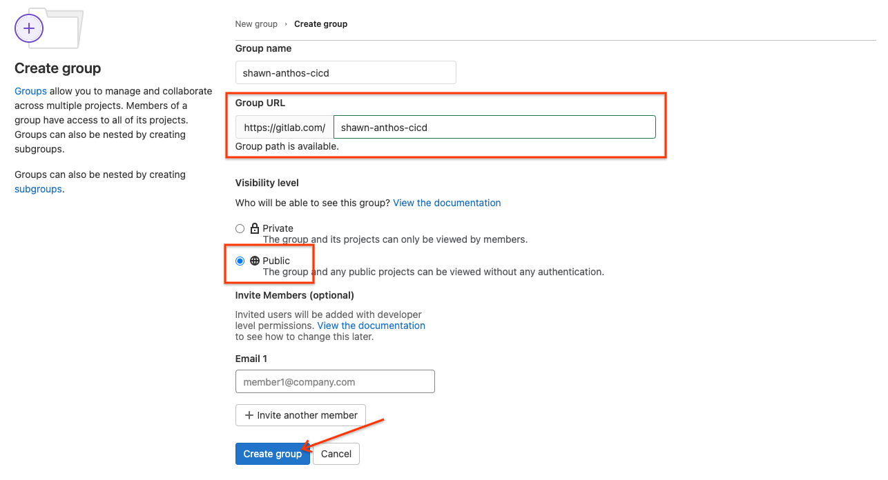
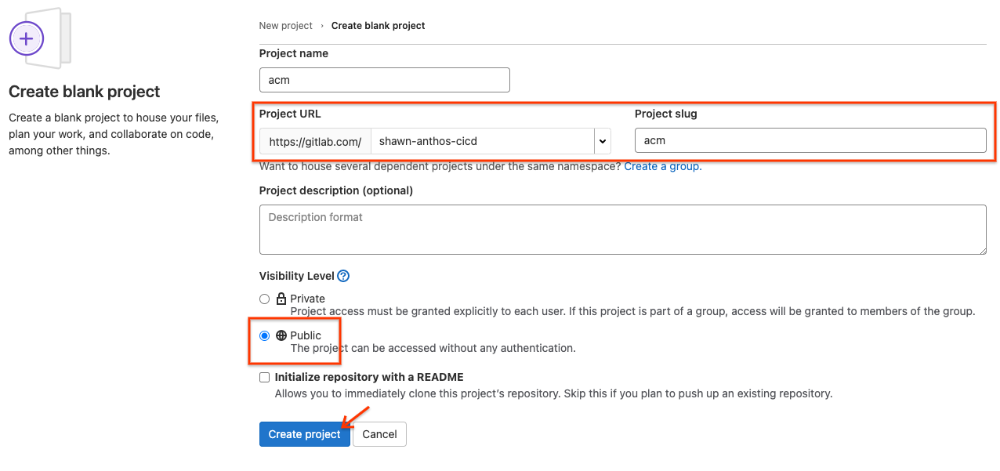
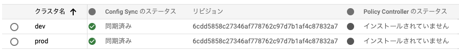

# Modern CI/CD with Anthos

## WIP: はじめに
Duration: 

> aside negative
> このラボは非公式です。Google Cloud の公式のチュートリアルではありません。

### WIP: 前提条件

## このラボについて
Duration: 

このラボでは Anthos と GitLab.com を使ったモダンな CI/CD パイプラインの構築を学びます。


### 参考リンク

* [Anthos を使用した最新の CI/CD](https://cloud.google.com/solutions/modern-ci-cd-with-anthos)
* [Modern CI/CD with Anthos: Demo Guide](https://github.com/GoogleCloudPlatform/professional-services/tree/main/examples/anthos-cicd-with-gitlab)

## 準備
Duration: 


### Google Cloud

ラボを実施するための[プロジェクトを作成](https://cloud.google.com/resource-manager/docs/creating-managing-projects)してください。
また、そのプロジェクトに有効な[ビリングアカウントをリンク](https://cloud.google.com/billing/docs/how-to/modify-project)してください。


### GitLab.com

このラボでは [GitLab.com](https://gitlab.com) を利用します。

もしアカウントを持っていない場合は[サインアップ](https://gitlab.com/users/sign_up)してください。
また、SSH鍵でのアクセスを設定していない場合は[SSH鍵ペアを作成して GitLab.com に登録](https://docs.gitlab.com/ee/ssh/)してください。

適当な名前の新しいパブリックグループを作成してください。
作成したグループに割り当てられたURLをメモしておいてください。
今後、このラボで作成されるリポジトリはすべてこのグループ内に作成されます。




### Google Cloud SDK

> aside positive
> Cloud Shell で作業している場合は不要です。

Google Cloud SDK (gcloud) をインストールしていない場合は[ドキュメント](https://cloud.google.com/sdk/docs/install)に従ってインストールしてください。

必要なコンポーネントをインストールしてください。

```console
gcloud components install alpha beta kubectl nomos
```

macOSとLinuxでは追加で`nomos`に対して以下の操作を行ってください。

* `nomos` バイナリをパスの通ったディレクトリに移動
  * (例) `mv /path/to/nomos /usr/local/bin/nomos`
* `nomos` バイナリに実行権を付与
  * (例) `chmod +x /usr/local/bin/nomos`

使用するプロジェクトを設定してください。

```console
gcloud config set project YOUR-PROJECT
```

### API の有効化

利用する Google Cloud の API を有効化してください。

```console
gcloud services enable \
   anthos.googleapis.com \
   anthosgke.googleapis.com \
   anthosaudit.googleapis.com \
   binaryauthorization.googleapis.com \
   cloudbuild.googleapis.com \
   containerscanning.googleapis.com \
   cloudresourcemanager.googleapis.com \
   container.googleapis.com \
   gkeconnect.googleapis.com \
   gkehub.googleapis.com \
   serviceusage.googleapis.com \
   stackdriver.googleapis.com \
   monitoring.googleapis.com \
   logging.googleapis.com
```

### WIP: 環境変数の設定

以下の環境変数を設定してください。

```console
export GROUP_NAME="<your gitlab group name>"

export PROJECT_ID="$(gcloud config get-value project)"
export PROJECT_NUMBER="$(gcloud projects describe "${PROJECT_ID}" --format='value(projectNumber)')"
export USER="<user email you are using>"
export GROUP_URI="<your gitlab group URI>"
export REGION="us-central1"
export ZONE="asia-northeast1-c"
```


## GKEクラスタの作成とAnthosへの登録
Duration: 

このラボでは`dev`と`prod`という2つのGKEクラスタを作成します。
`dev`クラスタは開発環境やテスト環境として利用するクラスタです。
`prod`クラスタは本番環境として利用します。

> aside positive
> このラボでは同じプロジェクトに開発環境と本番環境を作成していますが、
> 実際の利用ではプロジェクトも分割することをおすすめします。

### GKEクラスタの作成

`dev`クラスタを作成してください。

```console
gcloud container clusters create dev \
  --workload-pool=$(gcloud config get-value project).svc.id.goog \
  --machine-type e2-standard-4 \
  --zone asia-northeast1-c \
  --labels environment=dev
```

`prod`クラスタを作成してください。

```console
gcloud container clusters create prod \
  --workload-pool=$(gcloud config get-value project).svc.id.goog \
  --machine-type e2-standard-4 \
  --zone asia-northeast1-c \
  --labels environment=prod
```

### 必要な権限の付与

操作しているユーザーに必要な権限を付与します。

```console
gcloud projects add-iam-policy-binding \
  $(gcloud config get-value project) \
  --member user:$(gcloud config get-value account) \
  --role roles/gkehub.admin \
  --role roles/iam.serviceAccountAdmin \
  --role roles/iam.serviceAccountKeyAdmin \
  --role roles/resourcemanager.projectIamAdmin
```

### Anthosへの登録

作成したGKEクラスタを[Anthosへ登録](https://cloud.google.com/anthos/multicluster-management/connect/registering-a-cluster)します。

`dev`クラスタを登録してください。

```console
gcloud beta container hub memberships register dev \
  --gke-uri $(gcloud container clusters list --uri | grep dev) \
  --enable-workload-identity
```

`prod`クラスタを登録してください。

```console
gcloud beta container hub memberships register prod \
  --gke-uri $(gcloud container clusters list --uri | grep prod) \
  --enable-workload-identity
```

登録されたことを確認してください。

```console
gcloud beta container hub memberships list
```

> aside positive
> Anthos マネージドクラスタは[コンソール](https://console.cloud.google.com/anthos/clusters)でも確認できます。


## Anthos Config Managementの設定
Duration:

[Anthos Config Management](https://cloud.google.com/anthos/config-management) (ACM) は Anthos の主要コンポーネントのひとつです。
Anthos Config Management ではカスタムポリシーを含む設定を定義し、オンプレやマルチクラウドでその設定を適用することができます。

Anthos Config Management では設定やポリシーをGitリポジトリで管理できます。
典型的にはこのリポジトリは運用チームやセキュリティチームで管理します。
このラボで紹介するリポジトリモデルを使うと、開発者はアプリケーションの開発用のリポジトリで開発に専念して、運用チームやセキュリティチームはインフラに専念することができます。
クラスタがAnthos Config Managementリポジトリと同期している限り、Anthos Config Managementリポジトリ以外を使った方法での変更はできません。
これにより、構成を作成・変更する際にバージョン管理システムに伴うすべての利点を活用できます。

> aside positive
> より詳しい情報は[Anthos Config Managementのドキュメント](https://cloud.google.com/anthos-config-management/docs/concepts)を参照してください。

### Anthos Config Managementの有効化

Anthos Config Managementを有効化してください。

```console
gcloud alpha container hub config-management enable
```

### GitLabプロジェクトの作成

作成したGitLab.comのパグリックグループに新しく`acm`というパブリックプロジェクトを作成してください。



作成した空のリポジトリをクローンして[Config Sync](https://cloud.google.com/anthos-config-management/docs/config-sync-overview)用に初期化してください。

```console
cd ~
mkdir $GROUP_NAME
cd $GROUP_NAME
git clone git@gitlab.com:$GROUP_NAME/acm.git
cd acm
git switch -c main
nomos init
```

次のようなディレクトリとファイルが作成されます。

```console
.
├── README.md
├── cluster
├── clusterregistry
├── namespaces
└── system
    ├── README.md
    └── repo.yaml
```

> aside positive
> 階層リポジトリの詳細は[ドキュメント](https://cloud.google.com/anthos-config-management/docs/concepts/hierarchical-repo)を参照してください。

### Config Sync Operator のデプロイ

[Config Sync Operator](https://cloud.google.com/kubernetes-engine/docs/add-on/config-sync/how-to/installing#git-creds-secret)はKubernetesクラスタにConfig Syncの機能を提供する[Operator](https://kubernetes.io/docs/concepts/extend-kubernetes/operator/)です。

Operatorのマニフェストファイルをダウンロードしてください。

```console
cd ~/$GROUP_NAME/acm
mkdir setup
cd setup
gsutil cp gs://config-management-release/released/latest/config-management-operator.yaml config-management-operator.yaml
```

ダウンロードしたマニフェストを適用してConfig Sync Operatorを`dev`クラスタと`prod`クラスタにデプロイしてください。

```console
gcloud container clusters get-credentials dev --zone asia-northeast1-c
kubectl apply -f config-management-operator.yaml
gcloud container clusters get-credentials prod --zone asia-northeast1-c
kubectl apply -f config-management-operator.yaml
```

### Config Sync Operator の設定

それぞれのクラスタに対して、Config Syncの設定ファイルを作成します。

`setup`ディレクトリに移動してください。

```console
cd ~/$GROUP_NAME/acm
```

`dev`クラスタ用に`dev`ブランチを同期対象とする `config-management-dev.yaml` を作成してください。

```console
cd ~/$GROUP_NAME/acm/setup
cat > config-management-dev.yaml << EOF
apiVersion: configmanagement.gke.io/v1
kind: ConfigManagement
metadata:
  name: config-management
spec:
  clusterName: dev
  git:
    syncRepo: https://gitlab.com/$GROUP_NAME/acm.git
    syncBranch: dev
    secretType: none
  policyController:
    enabled: true
EOF
```

`dev`クラスタに設定を適用してください。

```console
gcloud container clusters get-credentials dev --zone asia-northeast1-c
kubectl apply -f config-management-dev.yaml
```

> aside positive
> 同期するgitリポジトリに関する設定に加えて、後述するPolicy Controllerを使用するために `policyController.enabled`を`true`に設定しています。

`prod`クラスタ用に `main` ブランチを同期対象とする `config-management-prod.yaml` を作成してください。

```console
cat > config-management-prod.yaml << EOF
apiVersion: configmanagement.gke.io/v1
kind: ConfigManagement
metadata:
  name: config-management
spec:
  clusterName: prod
  git:
    syncRepo: https://gitlab.com/$GROUP_NAME/acm.git
    syncBranch: main
    secretType: none
  policyController:
    enabled: true
EOF
```

`prod`クラスタに設定を適用してください。

```console
gcloud container clusters get-credentials prod --zone asia-northeast1-c
kubectl apply -f config-management-prod.yaml
```

> aside negative
> このラボではパブリックリポジトリを使用しているため `secretType` を `none` に設定しています。
> プライベートリポジトリを使用する場合は[ドキュメント](https://cloud.google.com/kubernetes-engine/docs/add-on/config-sync/how-to/installing#git-creds-secret)に従ってアクセス権を付与するための設定をしてください。

### ClusterSelectors の設定

[ClusterSelector](https://cloud.google.com/kubernetes-engine/docs/add-on/config-sync/how-to/clusterselectors)を使うと特定のクラスタ群にのみマニフェストを適用することが可能になります。

`dev`クラスタを選択するためのClusterSelectorを作成してください。

```console
cd ~/$GROUP_NAME/acm/clusterregistry
cat > dev-cluster-selector.yaml << EOF
kind: Cluster
apiVersion: clusterregistry.k8s.io/v1alpha1
metadata:
 name: dev
 labels:
   environment: dev
---
kind: ClusterSelector
apiVersion: configmanagement.gke.io/v1
metadata:
 name: dev-cluster-selector
spec:
 selector:
   matchLabels:
     environment: dev
EOF
```

`Cluster`リソースを使ってクラスタにラベルを付与できます。
この例では`dev`クラスタに`environment: dev`というラベルを付与します。

`ClusterSelector` は特定のラベルの組み合わせを持つクラスタを選択するためのリソースです。
この例では`environment: dev`というラベルを選択するための`dev-cluster-selector`というClusterSelectorを作成します。

同じように`prod`用のマニフェストを作成してください。

```console
cat > prod-cluster-selector.yaml << EOF
kind: Cluster
apiVersion: clusterregistry.k8s.io/v1alpha1
metadata:
 name: prod
 labels:
   environment: prod
---
kind: ClusterSelector
apiVersion: configmanagement.gke.io/v1
metadata:
 name: prod-cluster-selector
spec:
 selector:
   matchLabels:
     environment: prod
EOF
```

> aside negative
> ClusterSelector を使用するためには各クラスタに一意な名前をつける必要があります。

### Namespace の設定

Anthos Config Management ではマニフェストを[Namespaceスコープで管理](https://cloud.google.com/kubernetes-engine/docs/add-on/config-sync/concepts/namespace-inheritance)することができます。
また、前述のClusterSelectorと組合せることで柔軟な構成管理が可能になります。

今回使用する3つのNamespaceのマニフェストファイルを作成します。

まず、`dev`クラスタに適用する`dev` namespaceを作成してください。

```console
cd ~/$GROUP_NAME/acm/namespaces
mkdir dev
cd dev
cat > namespace.yaml << EOF
apiVersion: v1
kind: Namespace
metadata:
 name: dev
 annotations:
   configmanagement.gke.io/cluster-selector: dev-cluster-selector
EOF
```

`dev`クラスタに適用する `staging` namespaceを作成してください。

```console
cd ..
mkdir stage
cd stage
cat > namespace.yaml << EOF
apiVersion: v1
kind: Namespace
metadata:
 name: stage
 annotations:
   configmanagement.gke.io/cluster-selector: dev-cluster-selector
EOF
```

`prod` クラスタに適用する `prod` namespace を作成してください。

```console
cd ..
mkdir prod
cd prod
cat > namespace.yaml << EOF
apiVersion: v1
kind: Namespace
metadata:
 name: prod
 annotations:
   configmanagement.gke.io/cluster-selector: prod-cluster-selector
EOF
```

### 制約の設定

[Policy Controller](https://cloud.google.com/anthos-config-management/docs/concepts/policy-controller)を使うとクラスタに適用するマニフェストに制約を設けることができます。
ポリシーを遵守していないAPIリクエストをブロックしたり、違反を監査・報告したりできます。

> aside positive
> Policy Controllerはオープンソースの[Open Policy Agent Gatekeeper](https://open-policy-agent.github.io/gatekeeper/website/docs/)プロジェクトをベースにしています。

このラボでは `prod` namespaceに対して非特権コンテナの制約を設定します。

`cluster/`ディレクトリに`constraint-restrict-privileged-container.yaml`を作成してください。

```console
cd ~/$GROUP_NAME/acm/cluster
cat > constraint-restrict-privileged-container.yaml << EOF
apiVersion: templates.gatekeeper.sh/v1beta1
kind: ConstraintTemplate
metadata:
 name: noprivilegedcontainer
 annotations:
    configmanagement.gke.io/cluster-selector: prod-cluster-selector
spec:
 crd:
   spec:
     names:
       kind: NoPrivilegedContainer
 targets:
   - target: admission.k8s.gatekeeper.sh
     rego: |
       package noprivileged
       violation[{"msg": msg, "details": {}}] {
           c := input_containers[_]
           c.securityContext.privileged
           msg := sprintf("Privileged container is not allowed: %v, securityContext: %v", [c.name, c.securityContext])
       }
       input_containers[c] {
           c := input.review.object.spec.containers[_]
       }
       input_containers[c] {
           c := input.review.object.spec.initContainers[_]
       }
       input_containers[c] {
           c := input.review.object.spec.template.spec.containers[_]
       }
       input_containers[c] {
           c := input.review.object.spec.template.spec.initContainers[_]
       }
---
apiVersion: constraints.gatekeeper.sh/v1beta1
kind: NoPrivilegedContainer
metadata:
 name: no-privileged-container
 annotations:
    configmanagement.gke.io/cluster-selector: prod-cluster-selector
spec:
 enforcementAction: dryrun
 match:
   kinds:
     - apiGroups: ["*"]
       kinds: ["Deployment", "Pod"]
EOF
```

> aside positive
> Anthos Policy Controllerには[制約テンプレートライブラリ](https://cloud.google.com/anthos-config-management/docs/reference/constraint-template-library)の制約テンプレートが含まれています。

### 変更の適用

ここまでローカルでマニフェストファイルを作ってきました。
GitLabのリポジトリに変更をプッシュしてクラスタに変更を適用します。

変更をプッシュしてください。

```console
cd ~/$GROUP_NAME/acm
git add -A
git commit -m "Set up ACM"
git push -u origin main
```

`dev`クラスタは`dev`ブランチに同期されるようになっているので、同じ内容を`dev`ブランチとしてプッシュしてください。

```console
git switch -c dev
git push -u origin dev
```

変更が同期されているかどうかを確認してください。

```console
nomos status
```

`SYNCED`と表示されていれば同期が完了しています。
`PENDING`と表示されている場合はConfig Syncは正常に動作していますがまだ同期が完了していない状態です。

> aside positive
> Config Syncのステータスは[コンソール](https://console.cloud.google.com/anthos/config_management)でも確認できます。
> 


## CI/CD パイプラインの準備
Duration:

このラボではプラットフォーム運用・セキュリティチームが管理する`platform-admin`というリポジトリに再利用可能なCI/CDの部品を用意して、各アプリケーションチームがそれらの部品を組み合わせてCI/CDパイプラインを構築することを想定しています。

CI/CDには[GitLab CI/CD](https://docs.gitlab.com/ee/ci/)を利用します。
GitLab CI/CD では`.gitlab-ci.yml`というYAMLファイルにCI/CDのステップを定義します。

このセクションではこのラボの全体を通してどのようなCI/CDパイプラインを構築するか把握します。
また、あとに続くセクションでCI/CDパイプラインをステップごとに構築できるように準備をします。
準備として、`platform-admin`リポジトリに1つ部品を用意して、アプリケーションのリポジトリでその部品を利用したCI/CDパイプラインを定義します。

<!--__unsupported_import_zmcgv2epyv=cicd-prep.md-->


## Binary Authorization の設定
Duration:

このセクションでは[Binary Authorization](https://cloud.google.com/binary-authorization)を設定します。
Binary Authorization はセキュアなコンテナ サプライ チェーンを構築するためのコンポーネントのひとつです。
Binary Authorization を使うと、脆弱性のあるソフトウェアや不正なソフトウェアをデプロイしてしまうリスクを軽減することができます。

このラボでは、クラスターに対して以下のようなルールをBinary Authorizationで強制します。

* `dev`クラスタ、`prod`クラスタへデプロイするコンテナイメージは脆弱性スキャンで問題ないことを確認済みであること
* `prod`クラスタへデプロイするコンテナイメージはQAテストで問題ないことを確認済みであること

Binary Authorizationを使ったコンテナ サプライ チェーンでは、脆弱性スキャンやQAテストなどの各ステップで問題ないイメージに署名をします。
そして、デプロイの際に署名を検証することによってイメージをデプロイしていいかどうかを判断します。

<!--__unsupported_import_zmcgv2epyv=binauth.md-->


## イメージへの署名
Duration:

このセクションでは前の前のセクションで作成した鍵を使ってイメージに署名します。
ローカルで署名のプロセスを試してからそのプロセスをCI/CDに組み込みます。


## CI/CD パイプライン の構築
Duration:

<!--__unsupported_import_zmcgv2epyv=cicd.md-->
