# Anthos Config Management with GitLab

## はじめに
Duration: 5

> aside negative
> このラボは非公式であり、Google Cloud の公式のチュートリアルではありません。

### 前提条件

* Google Cloud アカウント
* 有効な Billing Account と紐付いている Google Cloud プロジェクト
  * クリーンアップしやすいようにこのラボ用の新規プロジェクトの利用をおすすめします
* 有効な Billing Account と紐付いている Google Cloud プロジェクト
* [Cloud SDK](https://cloud.google.com/sdk) (gcloud)

### Cloud SDK コンポーネントのインストール

> aside positive
> Cloud Shell の場合は必要ありません。

必要な gcloud コンポーネントをインストールしてください。

```console
gcloud components install kubectl alpha nomos
```

### プロジェクトの設定

使用するプロジェクトを設定してください。

```console
gcloud config set project YOUR-PROJECT
```

## このラボについて
Duration: 1

このラボでは [Anthos Config Management](https://cloud.google.com/anthos/config-management) について学びます。

Anthos Config Management は3つのコンポーネントで構成されます。

* [Config Sync](https://cloud.google.com/kubernetes-engine/docs/add-on/config-sync/overview)
* [Policy Controller](https://cloud.google.com/anthos-config-management/docs/concepts/policy-controller)
* [Hierarchy Controller](https://cloud.google.com/kubernetes-engine/docs/add-on/config-sync/concepts/hierarchy-controller)

本ラボではこのうち Config Sync を利用します。
次の図の構成を構築して、Config Sync によって GitLab のリポジトリで2つの GKE クラスタの設定を管理します。

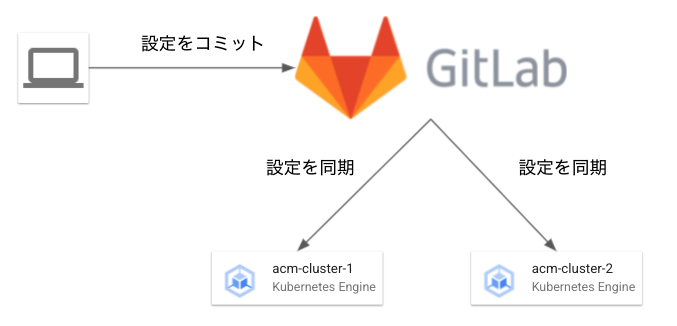

> aside positive
> GitLab も GKE クラスタ上で構築しますがこのラボでは ACM の管理対象外とします。


## GitLab の構築
Duration: 30

スクリプトを使って GitLab を構築します。
次のコマンドを実行してください。

```console
bash <(curl -sL https://raw.githubusercontent.com/ShawnLabo/google-cloud-tutorials/main/anthos/config-management-with-gitlab/deploy_gitlab.sh)
```

スクリプトが終了したら、[ヘルスチェック一覧](https://console.cloud.google.com/compute/healthChecks)にアクセスしてください。
パスが `/-/readiness` になっていないヘルスチェックがあればパスを `/-/readiness` に修正してください。

ヘルスチェックが成功してSSL証明書が発行されると GitLab にアクセスできるようになります。
SSL証明書の発行状況は[ロードバランサ](https://console.cloud.google.com/net-services/loadbalancing/loadBalancers/list)の詳細で確認できます。

スクリプトの最後に出力された URL にアクセスして、ユーザー名 `root` と表示されたパスワードでログインしてください。

## GKE クラスタの作成
Duration: 10

ACM で管理する2つの GKE クラスタを作成します。

### クラスタ1 (asia-northeast1)

1つ目のクラスタを asia-northeast1 (Tokyo) に作成します。

```console
gcloud container clusters create acm-cluster-1 \
  --region asia-northeast1 \
  --workload-pool $(gcloud config get-value project).svc.id.goog
```

操作しているユーザーに`cluster-admin`のロールを付与してクラスタを管理できるように [ClusterRoleBinding](https://kubernetes.io/docs/reference/access-authn-authz/rbac/) を作成します。

```console
gcloud container clusters get-credentials acm-cluster-1 --region asia-northeast1
kubectl create clusterrolebinding cluster-admin-binding \
  --clusterrole cluster-admin \
  --user $(gcloud config get-value account)
```

### クラスタ2 (us-centarl1)

2つ目のクラスタを us-central1 (Iowa) に作成します。
1つ目のクラスタと同様にClusterRoleBindingも作成します。

```console
gcloud container clusters create acm-cluster-2 \
  --region us-central1 \
  --workload-pool $(gcloud config get-value project).svc.id.goog
gcloud container clusters get-credentials acm-cluster-2 --region us-central1
kubectl create clusterrolebinding cluster-admin-binding \
  --clusterrole cluster-admin \
  --user $(gcloud config get-value account)
```

## GKE クラスタ を Anthos に登録
Duration: 3

各 GKE クラスタを Anthos に登録します。
また、Anthos Config Management を動作させるために ConfigManagement [CustomResource](https://kubernetes.io/docs/concepts/extend-kubernetes/api-extension/custom-resources/) を作成します。

作業前に Anthos と Anthos Config Management を有効化します。

```console
gcloud services enable anthos.googleapis.com
gcloud alpha container hub config-management enable
```

`acm-cluster-1` を Anthos に登録します。

```console
gcloud beta container hub memberships register acm-cluster-1 \
  --gke-cluster asia-northeast1/acm-cluster-1 \
  --enable-workload-identity
```

同様に `acm-cluster-2` を Anthos に登録します。

```console
gcloud beta container hub memberships register acm-cluster-2 \
  --gke-cluster us-central1/acm-cluster-2 \
  --enable-workload-identity
```

## SSH 認証鍵作成
Duration: 2

Config Sync には GitLab のリポジトリに対する読み取り権限が必要です。
このラボでは SSH 認証鍵ペアを使用して認証します。

次のコマンドで SSH 認証鍵ペアを作成してください。

```console
ssh-keygen -t ed25519 -N '' -f configsync_ed25519
```

`acm-cluster-1` に秘密鍵を Secret として追加します。

```console
gcloud container clusters get-credentials acm-cluster-1 --region asia-northeast1
kubectl create namespace config-management-system
kubectl create secret generic git-creds \
  --namespace config-management-system \
  --from-file=ssh=configsync_ed25519
```

同様に `acm-cluster-2` に秘密鍵を Secret として追加します。

```console
gcloud container clusters get-credentials acm-cluster-2 --region us-central1
kubectl create namespace config-management-system
kubectl create secret generic git-creds \
  --namespace config-management-system \
  --from-file=ssh=configsync_ed25519
```

次のチャプターのために公開鍵をコピーしておいてください。

```console
cat configsync_ed25519.pub
```

> aside positive
> SSH 認証鍵ペア以外の認証方法は[ドキュメント](https://cloud.google.com/anthos-config-management/docs/how-to/installing-config-sync#git-creds-secret)を参照してください。

## GitLab プロジェクトの作成
Duration: 3

クラスタを管理するための GitLab プロジェクト (リポジトリ) を作成します。

GitLab にログインして **New project** ボタンをクリックしてください。

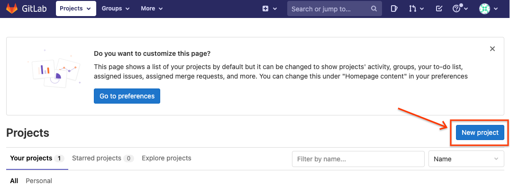

**Create blank project** をクリックしてください。

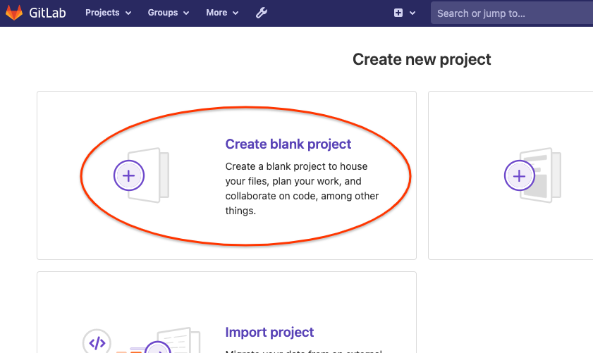

Project name に `acm` と入力して **Create project** ボタンをクリックしてください。

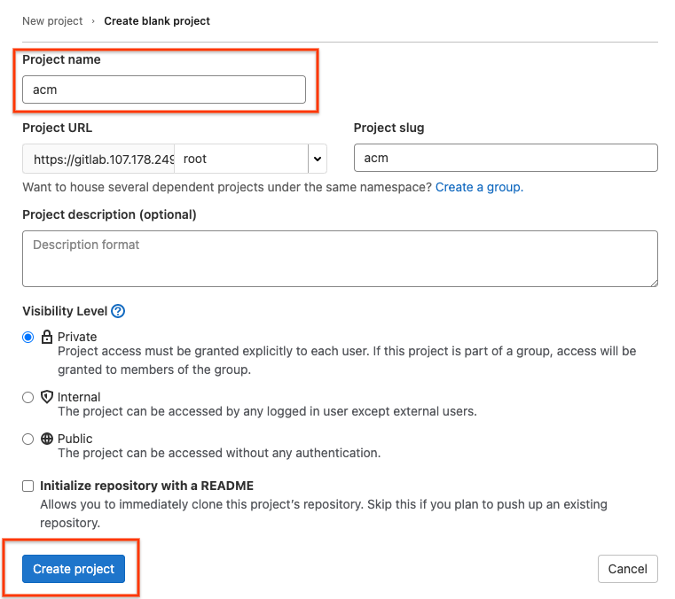

左メニューの **Settings** から **Repository** をクリックして、**Deploy keys** に作成した公開鍵を追加してください。

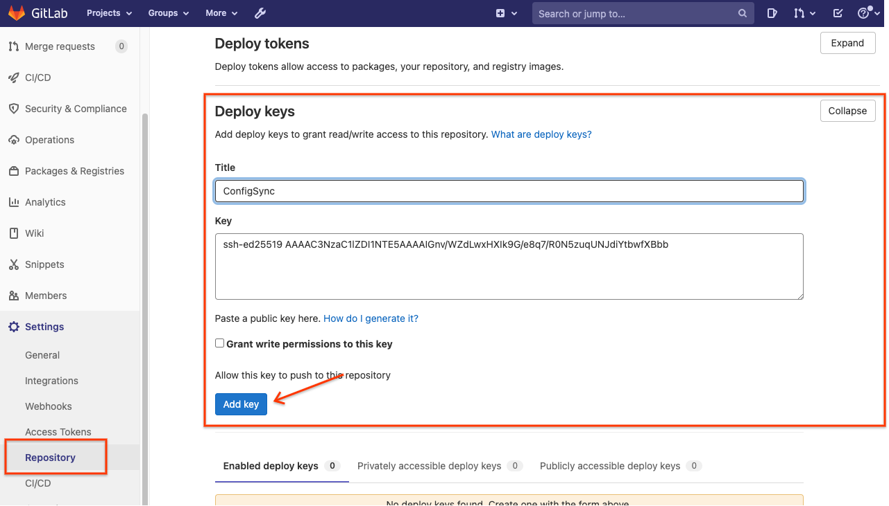

次のチャプターで Config Sync を設定するためにリポジトリの URL をコピーしておいてください。
左メニューの **Project overview** から **Clone** ボタンをクリックして、**Clone with SSH** のコピーボタンをクリックしてください。

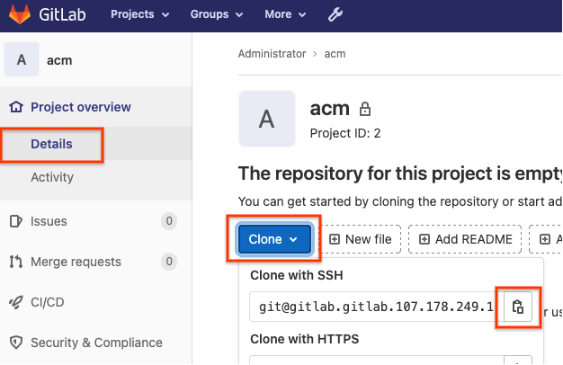

## Config Sync の設定
Duration: 3

[Config Management](https://console.cloud.google.com/anthos/config_management) にアクセスして **acm-cluster-1** を選択して **構成** をクリックしてください。

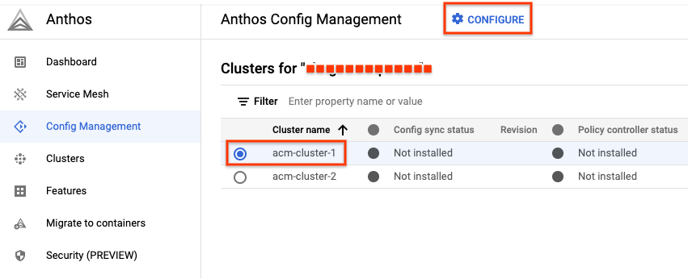

SSH 鍵については既に設定できているので、そのまま **続行** ボタンをクリックしてください。

**Config Sync を有効にする** にチェックを入れて、**URL** に GitLab リポジトリの URL を入力してください。
入力できたら **完了** ボタンをクリックしてください。

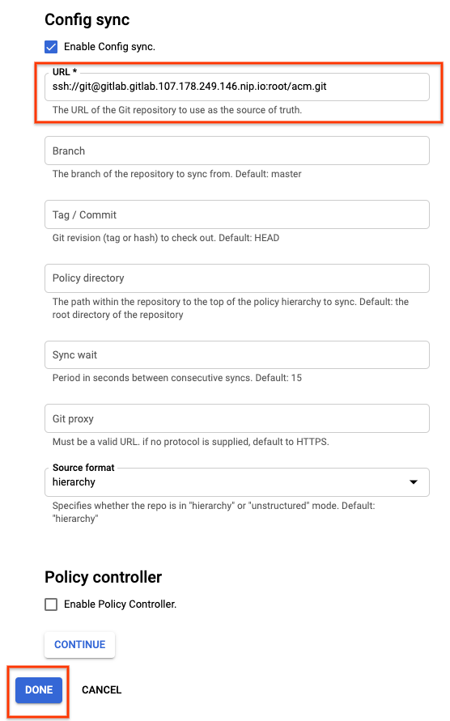

同様に **acm-cluster-2** を設定してください。

## hello-acm Namespace の作成

Config Sync が設定されるとリポジトリの更新が自動的にクラスタに反映されるようになります。

ここでは `hello-acm` という Namespace の YAML ファイルをリポジトリに追加して、2つのクラスタに反映されることを確認します。
YAML ファイルの追加は GitLab の UI 上で行います。

GitLab の **New file** ボタンをクリックしてください。

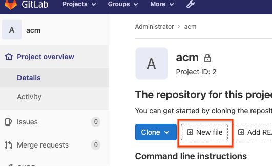

**New file** ボタンをクリックしてください。


`namespaces/hello-acm/namespaces.yaml` と入力して **Create file** ボタンをクリックしてください。

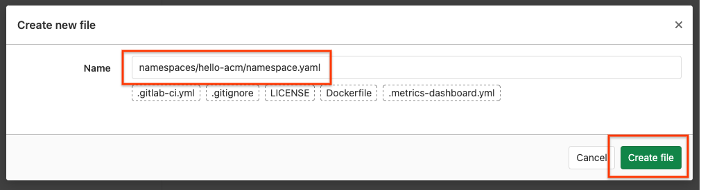

次の内容で YAML ファイルをコミットしてください。

```yaml
apiVersion: v1
kind: Namespace
metadata:
    name: hello-acm
```

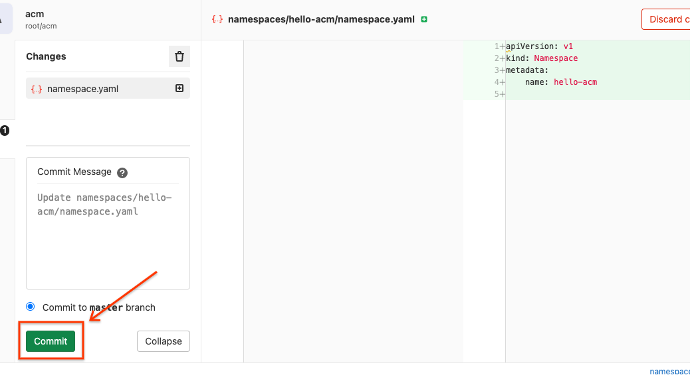

Namespace が各クラスタに作成されたか確認します。

```console
gcloud container clusters get-credentials acm-cluster-1 --region asia-northeast1
kubectl get namespaces
```

成功していれば次のように `hello-acm` Namespace が表示されます。

```console
```

同じように `acm-cluster-2` も確認してください。

> aside negative
> `hello-acm` Namespace が表示されない場合は Config Sync の設定が完了しているか確認してください。
> [Console](https://console.cloud.google.com/anthos/config_management) で確認できます。