# Anthos Config Management と GitLab による GitOps パイプラインの構築

## はじめに

Duration: 1

> aside negative
> このラボは Google Cloud の公式コンテンツではありません。

### 前提条件

ラボを開始るる前に以下のものをあらかじめ準備してください。

* Google Cloud アカウント
* ラボ用の Google Cloud プロジェクト
  * 有効な[請求先アカウント](https://cloud.google.com/billing/docs/how-to/modify-project?hl=ja)に紐付いていることを確認してください
  * ラボで作成したリソースをクリーンアップしやすいように新規プロジェクトの利用をおすすめします
* [Cloud Shell](https://cloud.google.com/shell)
  * このラボでは Cloud Shell での操作を前提にしています
  * Cloud Shell 以外で操作する場合は下記の指示に従ってください
* [GitLab.com](https://gitlab.com) アカウント
  * Cloud Shell 等の操作する端末で[SSH接続の設定](https://docs.gitlab.com/ee/ssh/)をしておいてください

### Cloud Shell 以外での操作

Cloud Shell 以外で操作する場合は次のツールがインストールしてください。

* [Cloud SDK](https://cloud.google.com/sdk) (`gcloud` コマンド)
* Git コマンド

また、ラボで使用する Cloud SDK コンポーネントをインストールしてください。

```console
gcloud components install alpha beta kubectl nomos
```

## このラボについて

Duration: 999

このラボでは複数の Kubernetes クラスタを GitOps で管理するためのパイプラインを構築します。
マニフェストの YAML を管理するために[GitLab.com](https://gitlab.com)を利用します。
また、[Anthos Config Management](https://cloud.google.com/anthos-config-management)の[Config Sync](https://cloud.google.com/anthos-config-management/docs/config-sync-overview)を使って Git リポジトリで管理されているマニフェストを各クラスタに同期します。

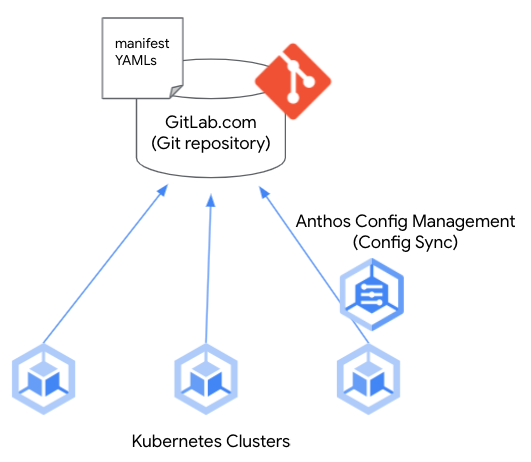

## パイプライン全体像

Duration: 999

このセクションでは、このラボで構築するパイプラインについて説明します。

### 全体アーキテクチャ

全体のアーキテクチャは次の図のようになります。
各コンポーネントの詳細はそれぞれ構築時に説明します。

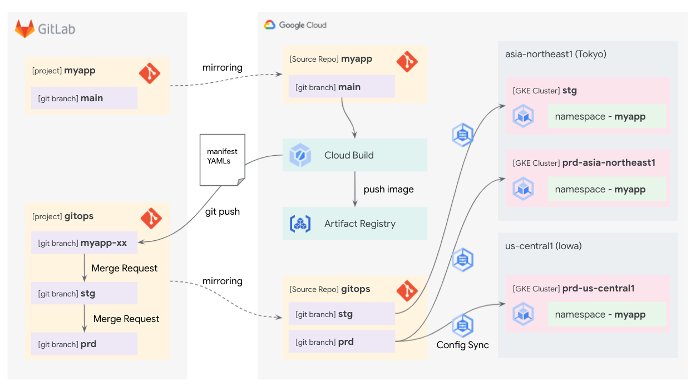

ここでは各コンポーネントについて簡単に説明します。

* [GitLab.com](https://gitlab.com)
  * GitLab 社が提供する Git のホストが可能な DevOps プラットフォームです。
  * このラボでは、アプリケーションの管理用に**myapp**プロジェクト、Kubernetes マニフェストの管理用に**gitops**プロジェクトをそれぞれ作成します。
* [Cloud Source Repository](https://cloud.google.com/source-repositories)
  * Google Cloud が提供する Git ホスティングサービスです。
  * GitLab の Git リポジトリをミラーリングして、Google Cloud との連携に利用します。
* [Cloud Build](https://cloud.google.com/build)
  * Google Cloud が提供するサーバーレス CI/CD プラットフォームです。
  * **myapp**プロジェクトが更新されると、最新のコンテナイメージをビルド・プッシュします。さらに、最新のイメージを利用した Kubernetes のマニフェスト YAML を**gitops**プロジェクトの新しいブランチにプッシュします。
* [Artifact Registry](https://cloud.google.com/artifact-registry)
  * Google Cloud が提供するビルドアーティファクト管理サービスです。
  * Cloud Build がビルドしたコンテナイメージを管理します。
* [Google Kubernetes Engine](https://cloud.google.com/kubernetes-engine) (GKE)
  * Google Cloud が提供するマネージド Kubernetes プラットフォームです。
  * このラボでは管理対象のクラスタを 3 つ作成します。そのうち 2 つは本番環境用クラスタで**gitops**プロジェクトの`prd`ブランチと同期します。残りの 1 つは開発環境用クラスタで**gitops**プロジェクトの`stg`ブランチと同期します。
* [Anthos Config Management](https://cloud.google.com/anthos/config-management) (ACM)
  * Google Cloud が提供する、1 つ以上の Kubernetes クラスタの構成とポリシーを一元管理するためのサービスです。
* [Config Sync](https://cloud.google.com/anthos-config-management/docs/config-sync-overview)
  * ACM の主要コンポーネントの 1 つです。Config Sync を利用すると、Kubernetes クラスタの構成やポリシーを Git リポジトリで一元管理できます。

### デプロイ ワークフロー

上記アーキテクチャにおいて、開発・テスト・デプロイをどのようなワークフローで実現するかを説明します。
次の図では、**myapp**というアプリの開発からデプロイまでのワークフローを表しています。

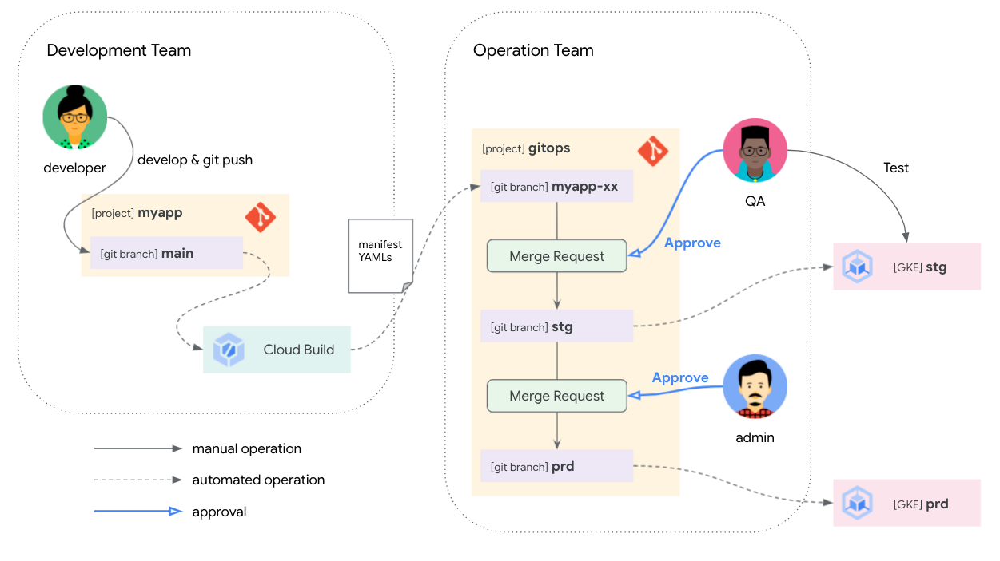

このラボでは開発チームと運用チームという 2 つのチームを想定しています。開発チームは**myapp**アプリケーションの開発を担当し、運用チームは品質保証 (QA) テストを実施したり本番環境を変更したりします。

> aside positive
> このラボでは簡単にするためチームを2つにしましたが、開発チーム、品質保証チーム、運用チームと3つに分かれていてもこのワークフローは機能します。

ワークフローの流れはこのようになります。

1. 開発チームは**myapp**プロジェクトで開発する
1. 開発者はデプロイしたいとき、**myapp**プロジェクトの`main`ブランチを更新する
1. **myapp**プロジェクトの`main`ブランチが更新されたとき、Cloud Build により**gitops**プロジェクトに新しいブランチがプッシュされる。そのブランチには最新の Kubernetes マニフェストが含まれる。
1. 開発者は**gitops**プロジェクトで自動生成されたブランチから`stg`ブランチに対する Merge Request を作成して品質保証チームに品質保証テストを依頼する
1. 品質保証担当者はステージング環境の準備ができていれば Merge Request を承認してマージする
1. Config Sync により`stg`ブランチのマニフェストがステージング環境の Kubernetes クラスタに同期される
1. 品質保証担当者はステージング環境で品質保証テストを実施して、OK であれば`prd`ブランチに対して Merge Request を作成する
1. 管理者は Merge Request を確認し、本番環境への適用が認められた場合に承認してマージする
1. Config Sync により`prd`ブランチのマニフェストが本番環境の Kubernetes クラスタに同期される

## Google Cloud の準備
Duration: 999

使用するプロジェクトを設定してください。

```console
gcloud config set project YOUR-PROJECT-ID
```

利用するサービスの API を有効化してください。

```console
gcloud services enable \
  anthos.googleapis.com \
  artifactregistry.googleapis.com \
  cloudbuild.googleapis.com \
  container.googleapis.com \
  gkehub.googleapis.com \
  secretmanager.googleapis.com \
  sourcerepo.googleapis.com
```

## Git リポジトリの準備
Duration: 999

このセクションでは GitLab.com で**myapp**プロジェクトと**gitops**プロジェクトを作成します。
また、Cloud Source Repositories でも 2 つの Git リポジトリを作成して、GitLab とのミラーリングを設定します。

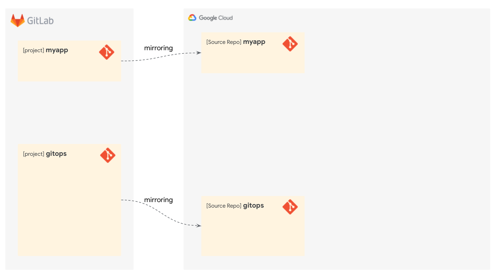

### GitLab Group の作成

このラボ用の GitLab Group を作成します。

[こちら](https://gitlab.com/groups/new#create-group-pane)にアクセスしてください。
適当な Group name を入力して**Create group**をクリックして、Group を作成してください。

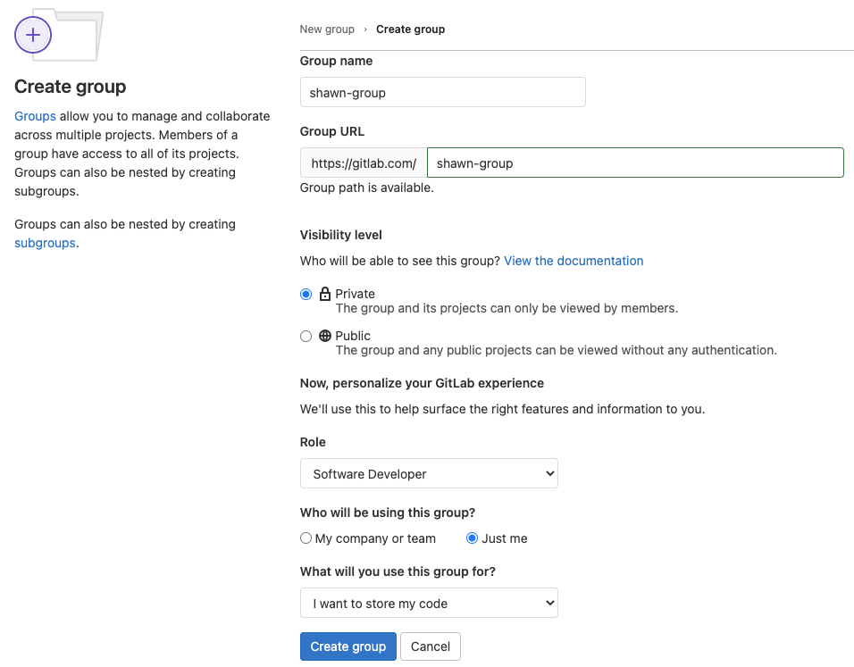

Group URL に設定した値を環境変数に設定してください。

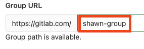

```console
export GITLAB_GROUP="your-group"
```

### GitLab Project の作成

作成した Group に Project を 2 つ作成します。

**New Project** をクリックしてください。

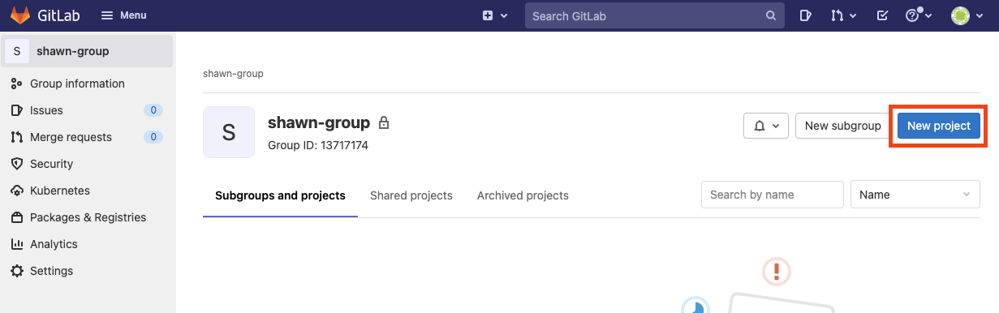

**Create blank project** をクリックしてください。

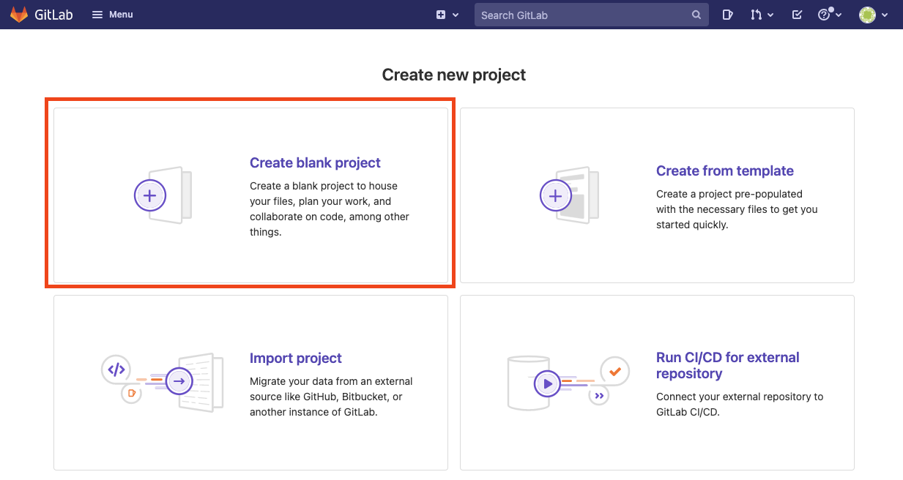

Project name と Project slug に`myapp`と入力して**Create Project**ボタンをクリックしてください。

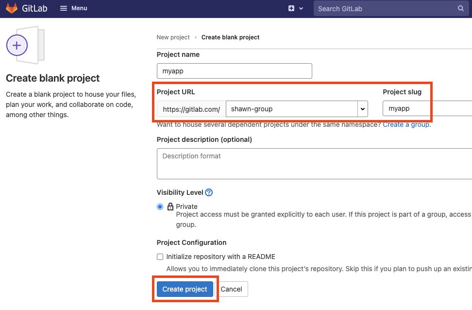

同様にして `gitops` Project を作成してください。

### Cloud Source Repositories の作成

Cloud Source Repositories で`myapp`と`gitops`リポジトリを作成して、GitLab からのミラーリングを設定するための認証情報を取得します。

`myapp`リポジトリと`gitops`リポジトリを作成してください。

```console
gcloud source repos create myapp
gcloud source repos create gitops
```

[Cloud Source Repositories](https://source.cloud.google.com/repos?hl=ja)にアクセスしてください。

作成した `myapp` をクリックしてください。

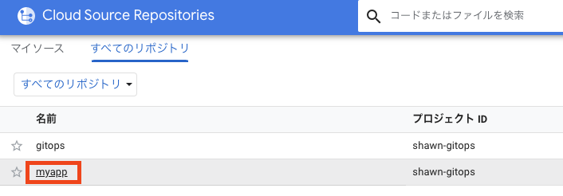

**手動で生成した認証情報**タブの**Git 認証情報を生成して保存します。**をクリックしてください。

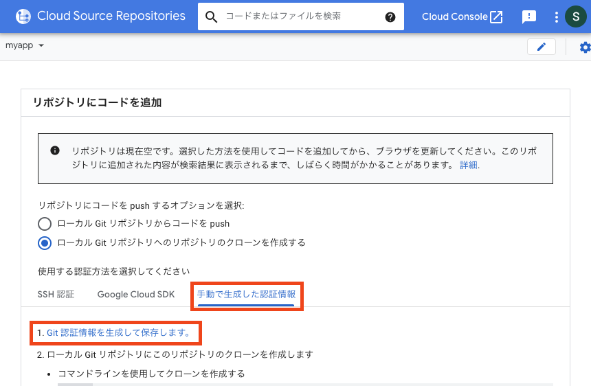

Google Cloud で利用しているアカウントを選択して、Google Cloud Development からの権限リクエストを許可してください。
**Configure Git**というページが表示されます。ハイライトされた部分をコピーしてください。


コピーした内容を Cloud Shell にペーストして実行してください。

以下のコマンドを実行してください。最後に表示される URL と Password を GitLab で利用します。

```console
csr_pass=$(grep 'source.developers.google.com' ~/.gitcookies | tail -1 | cut -d= -f2)
csr_user=$(grep 'source.developers.google.com' ~/.gitcookies | tail -1 | \
    cut -d$'\t' -f7 | cut -d= -f1)
myapp_repo=$(gcloud source repos describe myapp --format="value(url)")
gitops_repo=$(gcloud source repos describe gitops --format="value(url)")
cat <<EOF

======== Mirroring Credentials for myapp ========

URL: $(echo $myapp_repo | sed "s/:\/\//:\/\/${csr_user}@/")
Password: $csr_pass

======== Mirroring Credentials for gitops =======

URL: $(echo $gitops_repo | sed "s/:\/\//:\/\/${csr_user}@/")
Password: $csr_pass

=================================================
EOF
```

### ミラーリングの設定

GitLab のリポジトリから Cloud Source Repositories のリポジトリへのミラーリングを設定します。

GitLab の`myapp`リポジトリのメニューから**Settings**をクリックして**Repository**をクリックしてください。

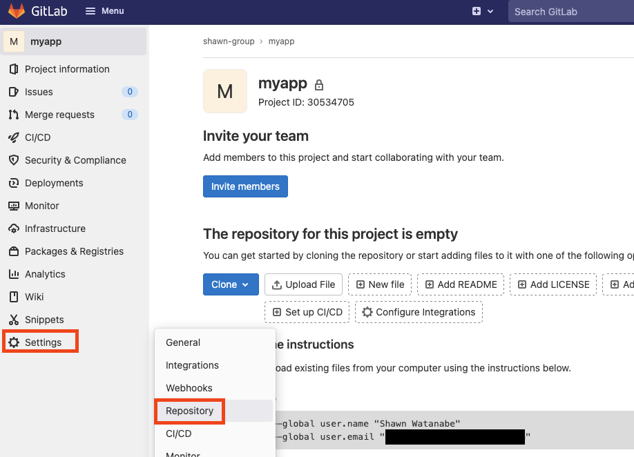

**Mirroring repositories**セクションの**Expand**ボタンをクリックしてください。
Cloud Shell で表示された`myapp`の URL と Password を入力して**Mirror repository**ボタンをクリックしてください。

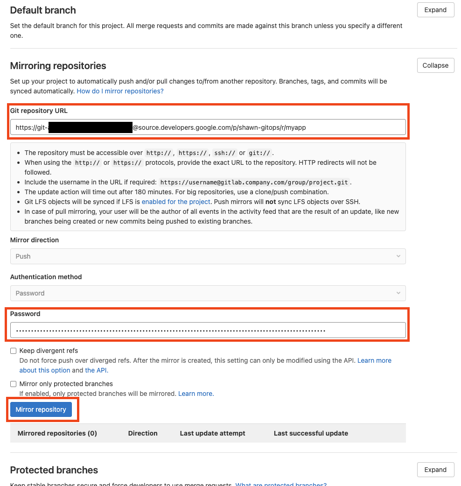

同様に`gitops`リポジトリもミラーリングを設定してください。

## コンテナイメージのビルド
Duration: 999

このセクションでは Cloud Build を使ってコンテナイメージのビルド・プッシュを自動化します。
また、コンテナとしてデプロイするアプリケーションを作成して`myapp`リポジトリにコミットします。

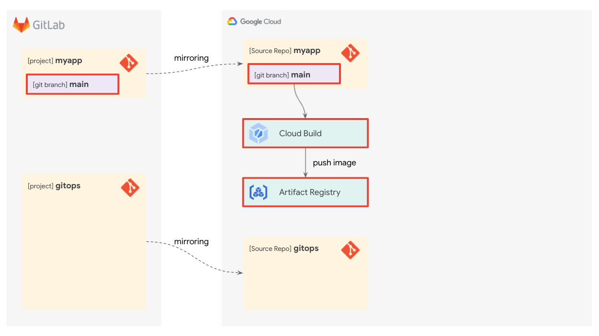

> Cloud ShellからGitLabへのSSH接続をまだ設定していない場合は設定してください。
> [GitLab and SSH Keys](https://docs.gitlab.com/ee/ssh/)

### アプリケーションの実装

myapp アプリを実装してコミットします。

GitLab の`myapp`リポジトリを Cloud Shell にクローンしてください。

> 環境変数 `GITLAB_GROUP` に作成したGitLabのGroup名が格納されていることを確認してください。

```console
git clone ssh://git@gitlab.com/$GITLAB_GROUP/myapp ~/workshop/gitops/myapp
cd ~/workshop/gitops/myapp
```

次のコマンドで Cloud Shell Editor を開いてください。

```console
cloudshell workspace .
```

**File**メニューの**New File**をクリックしてください。

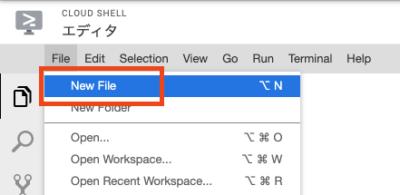

`main.py` と入力して **OK** をクリックしてください。

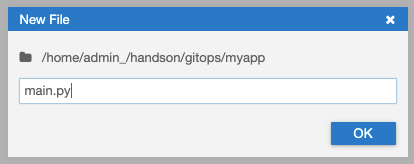

次のソースコードをコピーして Cloud Shell Editor で`main.py`にペーストしてください。

```console
from flask import Flask

app = Flask(__name__)

@app.route('/')
def home():
    return '<h1>Hello, world!</h1>'

if __name__ == '__main__':
    app.run(debug=False, host='0.0.0.0', port='5000')
```

> aside positive
> Cloud Shell Editor では変更が自動で保存されます。

同様にして、`Dockerfile` というファイルを作成してください。
次のコードをコピーして `Dockerfile` にペーストしてください。

```console
FROM python:3-slim-buster

RUN pip install --no-cache-dir flask

COPY main.py /main.py

CMD ["python", "/main.py"]
```

Cloud Shell 上で動作確認を行います。
右上の**ターミナルを開く**をクリックしてください。

Docker イメージをビルドしてください。

```console
docker build -t myapp .
```

ビルドしたイメージを元にコンテナを実行してください。

```console
docker run -d --rm -p 5000:5000 --name myapp myapp
```

実行したコンテナにリクエストしてください。
正常なレスポンスが返ってきたら成功です。

```console
curl localhost:5000
```

動作確認ができたので、コンテナを終了してください。

```console
docker kill myapp
```

ここまでの変更をコミットしてください。

```console
git checkout -b main
git add .
git commit -m "Implement myapp application"
```

### Artifact Registry の準備

myapp アプリケーションのコンテナイメージを管理するための Artifact Registry のリポジトリを作成します。

次のコマンドで作成してください。

```console
gcloud artifacts repositories create myapp \
  --repository-format docker \
  --location asia-northeast1
```

### Cloud Build の設定

myapp の Git リポジトリに変更があったとき、myapp アプリケーションの Docker イメージをビルドして Artifact Registry にプッシュするように Cloud Build を設定します。

Cloud Build にトリガーを作成してください。

```console
gcloud beta builds triggers create cloud-source-repositories \
  --name myapp-trigger \
  --repo myapp \
  --branch-pattern main \
  --build-config cloudbuild.yaml
```

`main`ブランチに変更があると`cloudbuild.yaml`に従ってビルドを実行するトリガーが作成されました。

次のコマンドで`cloudbuild.yaml`を作成してください。

```console
cat <<'EOF' > ~/workshop/gitops/myapp/cloudbuild.yaml
steps:
  - name: 'gcr.io/cloud-builders/docker'
    args: [
      'build',
      '-t', 'asia-northeast1-docker.pkg.dev/$PROJECT_ID/myapp/myapp:$COMMIT_SHA',
      '.'
    ]

images:
  - 'asia-northeast1-docker.pkg.dev/$PROJECT_ID/myapp/myapp:$COMMIT_SHA'
EOF
```

> aside positive
> ビルド構成ファイルの詳細については[ドキュメント](https://cloud.google.com/build/docs/build-config)を参照してください。

変更をコミットしてプッシュしてください。

```console
git add .
git commit -m "Add cloudbuild.yaml"
git push -u origin main
```

### 確認

myapp アプリケーションのコンテナイメージが Cloud Build でビルドされて Artifact Registry にプッシュされているかを確認します。

次のコマンドを実行してください。

```console
gcloud artifacts docker images list \
  asia-northeast1-docker.pkg.dev/$(gcloud config get-value project)/myapp/myapp
```

> aside negative
> GitLab.comの[ミラーリング機能](https://docs.gitlab.com/ee/user/project/repository/mirror/)は5分に1回以下という制限があるため、ビルドが完了するまでに時間がかかる場合があります。

次のように表示されれば myapp アプリケーションのコンテナイメージをビルドするパイプラインは正常に動作しています。

```console
IMAGE: asia-northeast1-docker.pkg.dev/shawn-gitops/myapp/myapp
DIGEST: sha256:680adf0512b424c0c8d34ed006fdf34f9bd1786605b450ed4fe797eccde9b996
CREATE_TIME: 2021-10-19T07:52:05
UPDATE_TIME: 2021-10-19T07:52:05
```

## GKE クラスタの作成と設定
Duration: 999

このセクションでは 3 つの Google Kubernetes Engine クラスタを作成して Config Sync により GitOps を設定します。

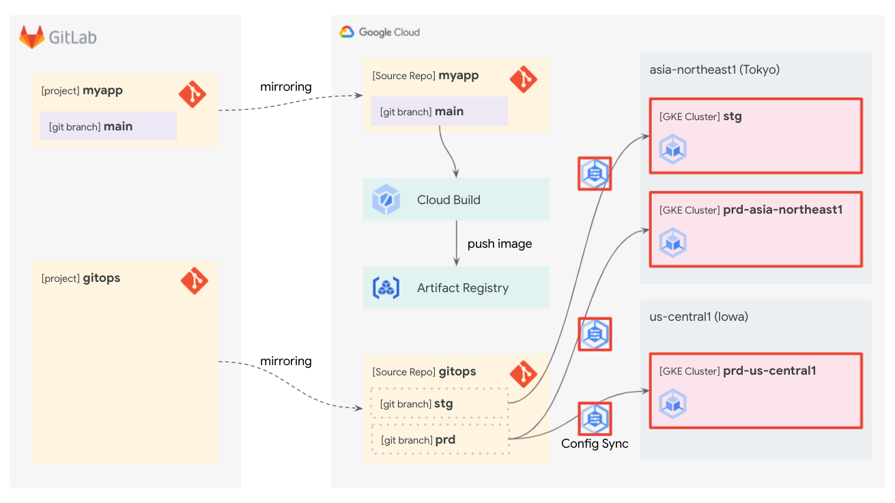

### GKE クラスタの作成

3 つの GKE クラスタを作成します。

東京リージョンの本番用クラスタ `prd-asia-northeast1` を作成してください。

```console
gcloud container clusters create prd-asia-northeast1 \
  --enable-ip-alias \
  --machine-type e2-standard-2 \
  --num-nodes 1 \
  --workload-pool=$(gcloud config get-value project).svc.id.goog \
  --region asia-northeast1
```

アイオワリージョンの本番用クラスタ `prd-us-central1` を作成してください。

```console
gcloud container clusters create prd-us-central1 \
  --enable-ip-alias \
  --machine-type e2-standard-2 \
  --num-nodes 1 \
  --workload-pool=$(gcloud config get-value project).svc.id.goog \
  --region us-central1
```

東京リージョンのステージング用クラスタ `stg` を作成してください。

```console
gcloud container clusters create stg \
  --enable-ip-alias \
  --machine-type e2-standard-2 \
  --num-nodes 1 \
  --workload-pool=$(gcloud config get-value project).svc.id.goog \
  --region asia-northeast1
```

### クラスタのフリートへの登録

作成したクラスタをフリートへ登録します。フリートへ登録することで、Anthos Config Management が利用できるようになります。

> aside positive
> [フリート](https://cloud.google.com/anthos/multicluster-management)はAnthosにおいて複数のKubernetesクラスタを管理するための論理グループです。

次のコマンドで 3 つのクラスタをフリートへ登録してください。

```console
gcloud beta container hub memberships register prd-asia-northeast1 \
  --gke-cluster asia-northeast1/prd-asia-northeast1 \
  --enable-workload-identity
gcloud beta container hub memberships register prd-us-central1 \
  --gke-cluster us-central1/prd-us-central1 \
  --enable-workload-identity
gcloud beta container hub memberships register stg \
  --gke-cluster asia-northeast1/stg \
  --enable-workload-identity
```

### Anthos Config Management の有効化

Anthos Config Management (ACM) を有効化して、Cloud Source Repositories の Git リポジトリにアクセスするための Service Account を設定します。

Anthos Config Management を有効化してください。

```console
gcloud beta container hub config-management enable
```

ACM の Kubernetes Service Account と Workload Identity によって紐付ける Google Service Account を作成します。

```console
gcloud iam service-accounts create acm-root-reconciler
```

> aside positive
> [Workload Identity](https://cloud.google.com/kubernetes-engine/docs/how-to/workload-identity)ではKubernetesのService AccountとGoogle CloudのService Accountを関連付けて、GKE内で実行されているアプリケーションのGoogle Cloudサービスへのアクセス権限を管理することができます。

作成した Service Account に Cloud Source Repository の読み取り権限を付与します。

```console
gcloud projects add-iam-policy-binding \
  $(gcloud config get-value project) \
  --member serviceAccount:acm-root-reconciler@$(gcloud config get-value project).iam.gserviceaccount.com \
  --role roles/source.reader
```

ACM の Kubernetes Service Account (`config-management-system/root-reconciler`)に作成した Google Service Account (`acm-root-reconciler@PROJET-ID.iam.gserviceaccount.com`)を Workload Identity で利用する権限を付与します。

```console
gcloud iam service-accounts add-iam-policy-binding \
    acm-root-reconciler@$(gcloud config get-value project).iam.gserviceaccount.com \
    --member "serviceAccount:$(gcloud config get-value project).svc.id.goog[config-management-system/root-reconciler]" \
    --role roles/iam.workloadIdentityUser
```

### Config Sync の設定

本番環境、ステージング環境それぞれに Config Sync を設定します。

> aside negative
> この段階ではまだ同期元のGitリポジトリが空なので何も同期されません。

このラボでは設定ファイルを`gitops`リポジトリで管理します。
`gitops`リポジトリをクローンしてください。

```console
git clone ssh://git@gitlab.com/$GITLAB_GROUP/gitops ~/workshop/gitops/gitops
cd ~/workshop/gitops/gitops
```

本番環境用の ACM 設定ファイルを作成してください。

```console
cat <<EOF > prd-apply-spec.yaml
applySpecVersion: 1
spec:
  configSync:
    enabled: true
    syncRepo: https://source.developers.google.com/p/$(gcloud config get-value project)/r/gitops
    syncBranch: prd
    secretType: gcpserviceaccount
    gcpServiceAccountEmail: acm-root-reconciler@$(gcloud config get-value project).iam.gserviceaccount.com
EOF
```

ステージング環境用の ACM 設定ファイルを作成してください。

```console
cat <<EOF > stg-apply-spec.yaml
applySpecVersion: 1
spec:
  configSync:
    enabled: true
    syncRepo: https://source.developers.google.com/p/$(gcloud config get-value project)/r/gitops
    syncBranch: stg
    secretType: gcpserviceaccount
    gcpServiceAccountEmail: acm-root-reconciler@$(gcloud config get-value project).iam.gserviceaccount.com
EOF
```

本番環境の GKE クラスタ 2 つに ACM の設定を適用してください。

```console
gcloud beta container hub config-management apply \
  --membership prd-asia-northeast1 \
  --config prd-apply-spec.yaml
gcloud beta container hub config-management apply \
  --membership prd-us-central1 \
  --config prd-apply-spec.yaml
```

ステージング環境の GKE クラスタに ACM の設定を適用してください。

```console
gcloud beta container hub config-management apply \
  --membership stg \
  --config stg-apply-spec.yaml
```

ここまでの変更をコミットしておきます。

```console
git checkout -b main
git add .
git commit -m "Configure ACM"
git push -u origin main
```

## Namespace の作成
Duration: 999

このセクションでは myapp アプリケーションのデプロイ先となる Kubernetes の Namespace `myapp` の YAML ファイルを作成します。
また、そのファイルを`gitops`リポジトリに`stg`ブランチとしてプッシュして、Config Sync でクラスタに同期します。

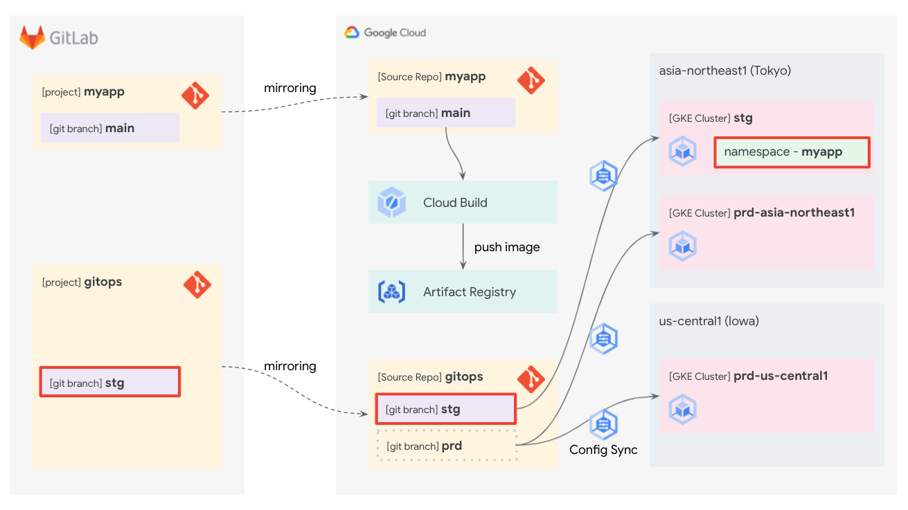

### Config Sync 構成の初期化

このラボでは Config Sync の[階層リポジトリ](https://cloud.google.com/anthos-config-management/docs/concepts/hierarchical-repo)を使ってマニフェストファイルを管理します。

`gitops`リポジトリを次のコマンドで初期化してください。

```console
cd ~/workshop/gitops/gitops
nomos init --force
```

次のようなファイルとディレクトリが作成されます。

```console
$ tree
.
├── cluster
├── clusterregistry
├── namespaces
├── prd-apply-spec.yaml
├── README.md
├── stg-apply-spec.yaml
└── system
    ├── README.md
    └── repo.yaml

4 directories, 5 files
```

この変更をコミットしてください。

```console
git add .
git commit -m "nomos init"
```

### namespaceマニフェストの作成

`myapp` Namespace のマニフェストファイルを作成してコミットします。

`myapp` Namespace 用のディレクトリを作成してください。今後、`myapp` Namespace に属するリソースのマニフェストはこのディレクトリへ格納することになります。

```console
mkdir -p namespaces/myapp
```

Namespace の YAML を作成してください。

```console
cat <<EOF > namespaces/myapp/namespace.yaml
apiVersion: v1
kind: Namespace
metadata:
  name: myapp
EOF
```

コミットしてプッシュしてください。

```console
git add .
git commit -m "Create myapp Namespace"
git push
```

### stgブランチの作成

現段階では`gitops`リポジトリに`main`ブランチしかないため GKE クラスタには同期されません。
ステージング環境用クラスタの Config Sync 同期元である`stg`ブランチを作成して、`myapp` Namespace が作成されることを確認します。

まず現在の Config Sync の状態を確認してください。

```console
gcloud beta container hub config-management status
```

3 つのクラスタすべて `Status: ERROR`となっています。
エラーメッセージには、次のように同期元の Git ブランチがないという記述があります。

```
fatal: Remote branch prd not found in upstream origin
```

`stg`ブランチを作成してプッシュします。

```console
git branch -c stg
git push origin stg
```

Config Sync の状態を確認してください。

```console
gcloud beta container hub config-management status
```

> aside negative
> GitLab.comの[ミラーリング機能](https://docs.gitlab.com/ee/user/project/repository/mirror/)は5分に1回以下という制限があるため、同期に時間がかかる場合があります。

`stg`クラスタが `Status: SYNCED` となっていれば、`stg`ブランチとの同期が成功しています。

実際に`myapp` Namespace が作成されているか確認してください。

```console
gcloud container clusters get-credentials stg \
  --region asia-northeast1
kubectl describe namespace myapp
```

このとき、Label や Annotation に Config Management のプロパティが含まれていることも確認してください。
例えば、`app.kubernetes.io/managed-by=configmanagement.gke.io`というラベルを見ることで Config Management によって管理されているリソースであることが確認できます。

## マニフェストの CI/CD
Duration: 999

このセクションでは myapp アプリケーションの CI/CD を実現するために、`myapp`リポジトリの変更を反映したマニフェストファイルを自動で`gitops`リポジトリにプッシュするパイプラインを構築します。

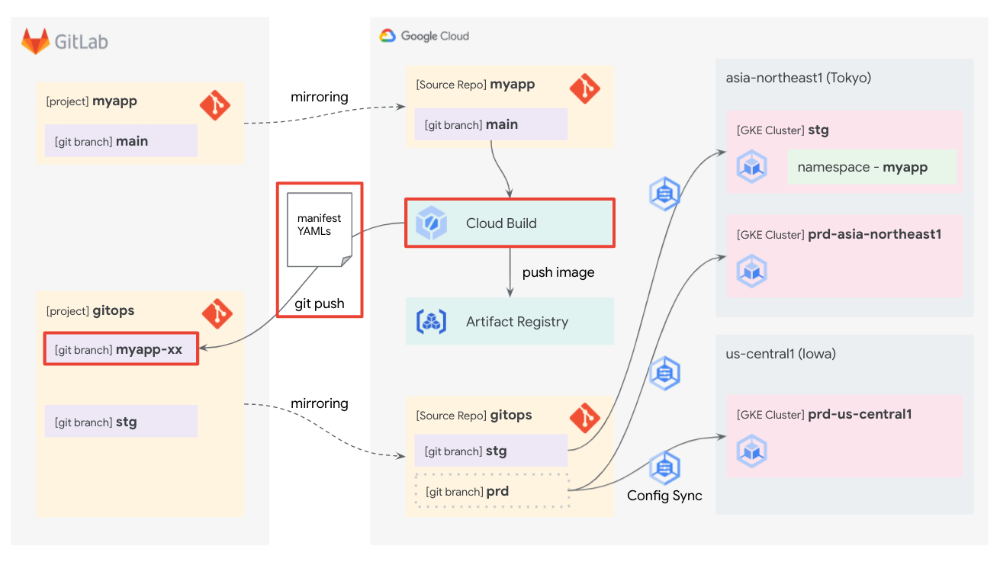

パイプラインの流れは次のようになります。

* `myapp` リポジトリの `main` ブランチが更新される
* (Cloud Source Repositories へミラーリングされる)
* Cloud Build がトリガーされる
* Cloud Build は以下のタスクを実行する
  * 最新の`myapp`リポジトリの`main`ブランチを使用してコンテナイメージをビルド・プッシュする
  * ビルドされた最新のコンテナイメージを利用した Deployment の YAML ファイルを生成する
  * 生成した YAML ファイルを `myapp-$COMMIT_SHA` という新しいブランチで `gitops` リポジトリにプッシュする

### デプロイキーを作成する

このラボでは Cloud Build から GitLab へのアクセスに[デプロイキー](https://docs.gitlab.com/ee/user/project/deploy_keys/index.html)を利用します。
また、Cloud Build から安全に秘密鍵を扱うために[Secret Manager](https://cloud.google.com/secret-manager)を利用します。

デプロイキーを作成してください。

```console
ssh-keygen -t ed25519 -N '' -f ~/workshop/gitops/deploy_key
```

作成した秘密鍵を Secret Manager に登録してください。

```console
cat ~/workshop/gitops/deploy_key | gcloud secrets create deploy-key --data-file=-
```

> aside positive
> 通常の利用時には流出防止のため Secret Manager に保存した後にローカルの秘密鍵は削除しておくことをおすすめします。

Cloud Build が Secret Manager から秘密鍵を取得できるように権限を付与してください。

```console
gcloud secrets add-iam-policy-binding \
  deploy-key \
  --member serviceAccount:$(gcloud projects describe $(gcloud config get-value project) --format 'value(projectNumber)')@cloudbuild.gserviceaccount.com \
  --role roles/secretmanager.secretAccessor
```

> aside positive
> Cloud Build におけるデプロイキーの利用は[こちらのドキュメント](https://cloud.google.com/build/docs/access-private-github-repos)も参考にしてください。

### GitLab へのデプロイキーの設定

GitLab の `gitops` リポジトリに作成したデプロイキーの公開鍵を登録します。
これにより、Cloud Build から `gitops` リポジトリへアクセスできるようになります。

作成した公開鍵の内容を表示してコピーしてください。

```console
cat ~/workshop/gitops/deploy_key.pub
```

GitLab の `gitops` プロジェクトを開いてください。
左のメニューから **Settings** の **Repository** を開いてください。

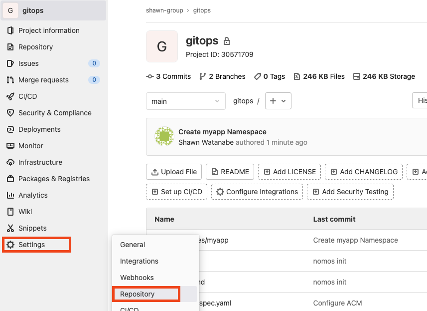

**Deploy keys** を開き、**Key** にコピーした公開鍵をペーストしてください。
**Grant write permissions to this key** にチェックを入れて **Add key** をクリックしてください。

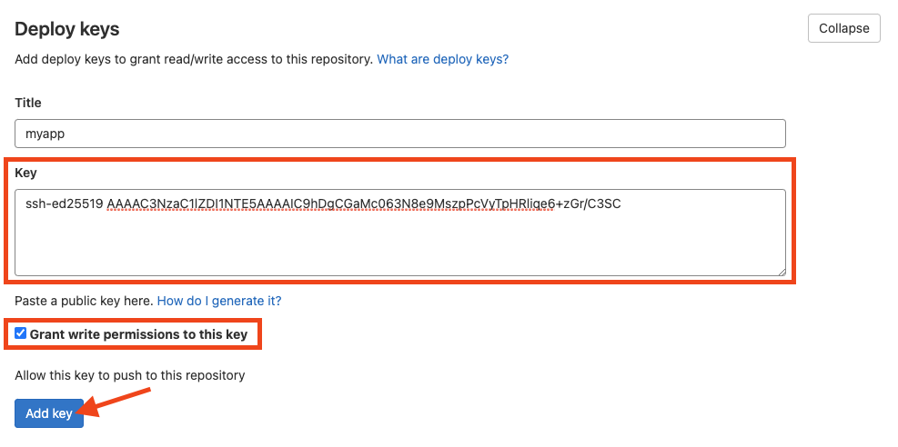

### myapp マニフェスト作成

myapp アプリを Kubernetes 上にデプロイするためのマニフェスト YAML を用意します。
このラボでは GKE 上でアプリケーションを公開するために Deployment、Service、Ingress のリソースを作成します。
Namespace は前のセクションで準備した `myapp` Namespace を利用します。

Deployment にはコンテナイメージを変数としたテンプレートを用意します。
Cloud Build では `myapp` リポジトリが更新されると最新コミットを元にイメージをビルド・プッシュして、そのイメージタグをテンプレートに埋め込んだ YAML を `gitops` リポジトリへコミットすることになります。

`myapp` リポジトリに移動してください。

```console
cd ~/workshop/gitops/myapp
```

`kubernetes` ディレクトリを作成してください。

```console
mkdir ~/workshop/gitops/myapp/kubernetes
```

Deployment の元になるテンプレートを作成してください。

```console
cat <<'EOF' > ~/workshop/gitops/myapp/kubernetes/deployment.yaml.tpl
apiVersion: apps/v1
kind: Deployment
metadata:
  namespace: myapp
  name: myapp
  labels:
    app: myapp
spec:
  replicas: 1
  selector:
    matchLabels:
      app: myapp
  template:
    metadata:
      labels:
        app: myapp
    spec:
      containers:
      - name: myapp
        image: $IMAGE_TAG
        ports:
        - containerPort: 5000
EOF
```

下から 3 行目の `image: $IMAGE_TAG` がコンテナイメージの変数になります。

Service の YAML を作成してください。

```console
cat <<EOF > ~/workshop/gitops/myapp/kubernetes/service.yaml
apiVersion: v1
kind: Service
metadata:
  namespace: myapp
  name: myapp
spec:
  type: ClusterIP
  selector:
    app: myapp
  ports:
  - protocol: TCP
    port: 5000
    targetPort: 5000
EOF
```

Ingress の YAML を作成してください。

```console
cat <<EOF > ~/workshop/gitops/myapp/kubernetes/ingress.yaml
apiVersion: networking.k8s.io/v1
kind: Ingress
metadata:
  namespace: myapp
  name: myapp
spec:
  defaultBackend:
    service:
      name: myapp
      port:
        number: 5000
EOF
```

### Cloud Build の設定

マニフェスト YAML を `gitops` リポジトリにコミットするスクリプトを作成して、Cloud Build でそのスクリプトを実行するように設定します。

GitLab Group が変数に格納されていることを確認してください。

```console
echo $GITLAB_GROUP
```

次のコマンドでスクリプトを作成してください。

```console
cat <<EOF > ~/workshop/gitops/myapp/deploy.sh
#!/bin/bash

gitlab_group=$GITLAB_GROUP

EOF
cat <<'EOF' >> ~/workshop/gitops/myapp/deploy.sh
app_repo="gitlab.com/${gitlab_group}/myapp"
ops_repo="gitlab.com/${gitlab_group}/gitops"

image_tag="asia-northeast1-docker.pkg.dev/${PROJECT_ID}/myapp/myapp:${COMMIT_SHA}"

branch="myapp-${COMMIT_SHA}"
commit_url="https://${app_repo}/-/commit/${COMMIT_SHA}"

# マニフェスト テンプレートをレンダリングするために envsubst をインストール

apt-get update
apt-get install --no-install-recommends -y gettext-base

# gitops リポジトリにアクセスするために必要なSSHの設定
# Secret Managerから取得したデプロイキーの秘密鍵は Cloud Build の設定で
# MANIFEST_DEPLOY_KEY 変数に格納される

mkdir /root/.ssh
echo "${MANIFEST_DEPLOY_KEY}" > /root/.ssh/id_ed25519

cat <<CONFIG > /root/.ssh/config
HOST *
  StrictHostKeyChecking no
  UserKnownHostsFile=/dev/null
CONFIG

chmod 400 /root/.ssh/{id_ed25519,config}
chmod 700 /root/.ssh

# gitops リポジトリを gitops ディレクトリにクローン

git clone ssh://git@${ops_repo} gitops

# マニフェスト YAML を gitops リポジトリの namespaces/myapp ディレクトリにコピー

for f in $(ls kubernetes/*.yaml); do
  cp $f gitops/namespaces/myapp/
done

# マニフェスト テンプレートをレンダリングして
# gitops リポジトリの namespaces/myapp ディレクトリに格納

export IMAGE_TAG="${image_tag}"

for f in $(ls kubernetes/*.yaml.tpl); do
  < $f envsubst > gitops/namespaces/myapp/${f%.tpl}
done

# マニフェストをコミットして新しいブランチとしてプッシュ

cd gitops
git config user.name "Cloud Build"
git config user.email "cloudbuild@example.com"
git checkout -b ${branch}
git add .
git commit -m "Auto commit by Cloud Build from ${commit_url}"
git push origin ${branch}
EOF
```

次のコマンドでスクリプトを表示してスクリプトの内容を確認してください。

```console
cat ~/workshop/gitops/myapp/deploy.sh
```

作成したスクリプトを実行するように `cloudbuild.yaml` を修正してください。

```console
cat <<'EOF' > ~/workshop/gitops/myapp/cloudbuild.yaml
steps:
  - name: 'gcr.io/cloud-builders/docker'
    args: [
      'build',
      '-t', 'asia-northeast1-docker.pkg.dev/$PROJECT_ID/myapp/myapp:$COMMIT_SHA',
      '.'
    ]
  - name: 'gcr.io/cloud-builders/git'
    entrypoint: 'bash'
    args: ['./deploy.sh']
    env:
      - 'PROJECT_ID=$PROJECT_ID'
      - 'COMMIT_SHA=$COMMIT_SHA'
    secretEnv:
      - 'MANIFEST_DEPLOY_KEY'

images:
  - 'asia-northeast1-docker.pkg.dev/$PROJECT_ID/myapp/myapp:$COMMIT_SHA'

availableSecrets:
  secretManager:
    - versionName: projects/$PROJECT_ID/secrets/deploy-key/versions/latest
      env: 'MANIFEST_DEPLOY_KEY'
EOF
```

### 変更をコミット

これまでの変更を `myapp` リポジトリにコミットしてください。

```console
cd ~/workshop/gitops/myapp
git add .
git commit -m "Add deploy script"
git push
```

このコミットにより、新しい Cloud Build のパイプラインが実行され、GitLab の `gitops` リポジトリに新しいブランチがプッシュされます。

## aa
Duration: