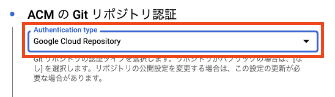
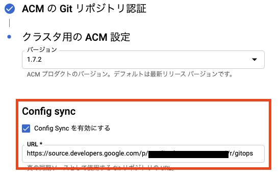

# Getting Started with Config Sync

## はじめに
Duration: 5

> aside negative
> このラボは非公式であり、Google Cloud の公式のチュートリアルではありません。

### 前提条件

* Google Cloud アカウント
* 有効な Billing Account と紐付いている Google Cloud プロジェクト
  * クリーンアップしやすいようにこのラボ用の新規プロジェクトの利用をおすすめします
* 有効な Billing Account と紐付いている Google Cloud プロジェクト
* [Cloud SDK](https://cloud.google.com/sdk) (gcloud)

### Cloud SDK コンポーネントのインストール

> aside positive
> Cloud Shell の場合は必要ありません。

必要な gcloud コンポーネントをインストールしてください。

```console
gcloud components install kubectl alpha nomos
```


## このラボについて
Duration: 1

このラボでは [Config Sync](https://cloud.google.com/kubernetes-engine/docs/add-on/config-sync/config-sync-overview) について学びます。

Config Sync は [Anthos Config Management](https://cloud.google.com/anthos/config-management) のコンポーネントのひとつであり、GitOps の機能を Kubernetes に提供します。

このラボでは Config Sync を使って Source Repository にある Kubernetes のマニフェストを GKE クラスタに自動で適用します。


## 準備
Duration: 3

### プロジェクトの設定

使用するプロジェクトを設定してください。

```console
gcloud config set project YOUR-PROJECT
```

### API の有効化

利用するサービスの API を有効化します。

```console
gcloud services enable \
  anthos.googleapis.com \
  container.googleapis.com \
  sourcerepo.googleapis.com
```

### Anthos Config Management の有効化

Anthos Config Management を有効化します。

```console
gcloud alpha container hub config-management enable
```


## GKE クラスタの準備
Duration: 10

Config Sync を適用する GKE クラスタを作成します。

```console
gcloud container clusters create acm-cluster \
  --region asia-northeast1 \
  --workload-pool $(gcloud config get-value project).svc.id.goog \
  --scopes gke-default,cloud-source-repos-ro
```

操作しているユーザーに`cluster-admin`のロールを付与してクラスタを管理できるように [ClusterRoleBinding](https://kubernetes.io/docs/reference/access-authn-authz/rbac/) を作成します。

```console
kubectl create clusterrolebinding cluster-admin-binding \
  --clusterrole cluster-admin \
  --user $(gcloud config get-value account)
```

作成した GKE クラスタを Anthos に登録します。

```console
gcloud beta container hub memberships register acm-cluster \
  --gke-cluster asia-northeast1/acm-cluster \
  --enable-workload-identity
```

Config Sync Operator をデプロイします。

```console
gsutil cp gs://config-management-release/released/latest/config-sync-operator.yaml config-sync-operator.yaml
kubectl apply -f config-sync-operator.yaml
```


## Source Repository の準備
Duration: 2

Kubernetes のマニフェストを管理するための Source Repository を作成します。

```console
gcloud source repos create gitops
```

Config Sync にはリポジトリへの読み取り権限が必要です。
このラボではサービスアカウントを利用して権限を付与します。

```console
gcloud projects add-iam-policy-binding $(gcloud config get-value project) \
  --member serviceAccount:$(gcloud projects describe $(gcloud config get-value project) --format "value(projectNumber)")-compute@developer.gserviceaccount.com \
  --role roles/source.reader
```

> aside negative
> サービスアカウントによる認証は [Cloud Source Repositories](https://cloud.google.com/source-repositories) でのみサポートされています。その他の認証方法は[ドキュメント](https://cloud.google.com/kubernetes-engine/docs/add-on/config-sync/how-to/installing#git-creds-secret)を参照してください。

今回の GKE クラスタは [Workload Identity](https://cloud.google.com/kubernetes-engine/docs/how-to/workload-identity) が有効になっているため Google サービスアカウント と Kubernetes サービスアカウント を紐付ける必要があります。

```console
gcloud iam service-accounts add-iam-policy-binding \
  $(gcloud projects describe $(gcloud config get-value project) --format "value(projectNumber)")-compute@developer.gserviceaccount.com \
  --role roles/iam.workloadIdentityUser \
  --member "serviceAccount:$(gcloud config get-value project).svc.id.goog[config-management-system/importer]"
```


## Config Sync の構築
Duration:

```console
cat <<EOF > config-management.yaml
apiVersion: configmanagement.gke.io/v1
kind: ConfigManagement
metadata:
  name: config-management
spec:
  clusterName: acm-cluster
EOF
kubectl apply -f config-management.yaml
```

```console
cat <<EOF > root-sync.yaml
apiVersion: configsync.gke.io/v1beta1
kind: RootSync
metadata:
  name: root-sync
  namespace: config-management-system
spec:
  git:
    repo: https://source.developers.google.com/p/$(gcloud config get-value project)/r/gitops
    branch: master
    auth: gcenode
EOF
kubectl apply -f root-sync.yaml
```

```console
cat <<EOF > config-management.yaml
apiVersion: configmanagement.gke.io/v1
kind: ConfigManagement
metadata:
  name: config-management
spec:
  sourceFormat: hierarchy
  git:
    syncRepo: https://source.developers.google.com/p/$(gcloud config get-value project)/r/gitops
    syncBranch: master
    secretType: ssh
    policyDir: /
EOF
gcloud alpha container hub config-management apply --membership acm-cluster --config config-management.yaml
```

```console
gcloud projects add-iam-policy-binding $(gcloud config get-value project) --member=user:$(gcloud config get-value account) --role=roles/gkehub.admin
```


[Config Management](https://console.cloud.google.com/anthos/config_management) にアクセスして **acm-cluster** を選択して **構成** をクリックしてください。


> aside negative
> Config Management は日本語表記では「構成管理」となっています。

**ACM の Git リポジトリ認証** の **Authentication type** に **Google Cloud Repository** を選択して **続行** ボタンをクリックしてください。



**Config Sync を有効にする** にチェックを入れて、URLに次のコマンドの結果を入力してください。

```console
gcloud source repos describe gitops --format "value(url)"
```



**完了** ボタンをクリックしてください。


## hello-acm Namespace

```console
git config --global user.email $(gcloud config get-value account)
git config --global user.name $USER
```

```console
gcloud source repos clone gitops
cd gitops
mkdir -p namespaces/hello-acm
cat <<EOF > namespaces/hello-acm/namespace.yaml
apiVersion: v1
kind: Namespace
metadata:
    name: hello-acm
EOF
git add .
git commit -m "Add hello-acm namespace"
git push -u origin master
```


---

```
gcloud container clusters create test-cluster --zone asia-northeast1

gcloud container clusters get-credentials test-cluster --zone asia-northeast1-a

kubectl create clusterrolebinding cluster-admin-binding --clusterrole cluster-admin --user $(gcloud config get-value account)

gcloud alpha container hub config-management enable

gcloud container clusters update test-cluster --workload-pool=$(gcloud config get-value project).svc.id.goog --zone asia-northeast1-a

gcloud beta container hub memberships register test-cluster --gke-cluster=asia-northeast1-a/test-cluster --enable-workload-identity

cat <<EOF > config-management.yaml
apiVersion: configmanagement.gke.io/v1
kind: ConfigManagement
metadata:
  name: config-management
  namespace: config-management-system
spec:
  sourceFormat: unstructured
  git:
    syncRepo: https://github.com/GoogleCloudPlatform/anthos-config-management-samples
    syncBranch: init
    secretType: none
    policyDir: quickstart/multirepo/root
EOF
```