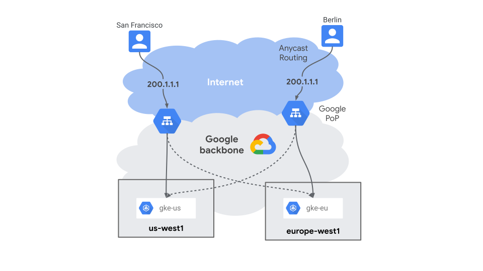

# Global App with Anthos

## はじめに

Duration: 1

> aside negative
> このラボは Google Cloud の公式コンテンツではありません。

### 前提条件

ラボを開始する前に以下のものをあらかじめ準備してください。

* Google Cloud アカウント
* ラボ用の Google Cloud プロジェクト
  * 有効な[請求先アカウント](https://cloud.google.com/billing/docs/how-to/modify-project?hl=ja)に紐付いていることを確認してください
  * ラボで作成したリソースをクリーンアップしやすいように新規プロジェクトの利用をおすすめします
* [Cloud Shell](https://cloud.google.com/shell)
  * このラボでは Cloud Shell での操作を前提にしています
  * Cloud Shell 以外で操作する場合は下記の指示に従ってください。

### Cloud Shell 以外での操作

Cloud Shell 以外で操作する場合は次のツールがインストールしてください。

* [Cloud SDK](https://cloud.google.com/sdk) (`gcloud` コマンド)
* [jq](https://stedolan.github.io/jq/)

また、ラボで使用する Cloud SDK コンポーネントをインストールしてください。

```console
gcloud components install alpha beta kubectl nomos
```

## このラボについて

Duration: 3

このラボではグローバルに分散されたマイクロブログ アプリケーションを構築します。
また、各地域のクライアントからどのようにアクセスされるかを確認します。

アプリケーションとクライアントの外観を図にすると次のようになります。


このアプリケーションのアーキテクチャは以下の特徴があります。

* スケーラブル
  * コンテナ化されていて [Google Kubernetes Engine](https://cloud.google.com/kubernetes-engine) 上で実行されている
  * データベースに [Cloud Spanner](https://cloud.google.com/spanner) を利用している
* 低レイテンシ
  * GKE クラスタがアメリカ、ヨーロッパ、アジアに分散されていて、地理的に近いクラスタで処理できる
  * Spanner のノードが各クラスタと同じリージョンにあり、高速にデータの読み取りができる
* 単一 IP アドレス
  * 単一のエニーキャスト IP でのグローバルな負荷分散を実現するために [Cloud Load Balancing](https://cloud.google.com/load-balancing) を利用している
  * 複数クラスタにまたがって分散するロードバランサを作成するために [Multi Cluster Ingress](https://cloud.google.com/kubernetes-engine/docs/concepts/multi-cluster-ingress) を利用している
* GitOps
  * 複数クラスタの管理を一元化するために GitOps を利用している
  * GitOps を利用するために [Config Sync](https://cloud.google.com/anthos-config-management/docs/config-sync-overview) を利用している

## 準備

Duration: 3

### プロジェクトの設定

使用するプロジェクトを設定してください。

```console
gcloud config set project YOUR-PROJECT
```

### API の有効化

利用するサービスの API を有効化してください。

```console
gcloud services enable \
  anthos.googleapis.com \
  container.googleapis.com \
  gkehub.googleapis.com \
  multiclusteringress.googleapis.com \
  sourcerepo.googleapis.com \
  spanner.googleapis.com
```

## GKE クラスタの作成

Duration: 13

このセクションでは北アメリカ、ヨーロッパ、アジアのリージョンにそれぞれクラスタを1つずつ作成します。

`us-central1` (アイオワ) にクラスタを作成してください。

```console
gcloud container clusters create us \
  --enable-ip-alias \
  --machine-type e2-standard-2 \
  --num-nodes 1 \
  --workload-pool=$(gcloud config get-value project).svc.id.goog \
  --region us-central1
```

`europe-west1` (ベルギー) にクラスタを作成してください。

```console
gcloud container clusters create europe \
  --enable-ip-alias \
  --machine-type e2-standard-2 \
  --num-nodes 1 \
  --workload-pool=$(gcloud config get-value project).svc.id.goog \
  --region europe-west1
```

`asia-east1` (台湾) にクラスタを作成してください。

```console
gcloud container clusters create asia \
  --enable-ip-alias \
  --machine-type e2-standard-2 \
  --num-nodes 1 \
  --workload-pool=$(gcloud config get-value project).svc.id.goog \
  --region asia-east1
```

kubectl コマンドのクラスタ コンテキストの名前を変更してください。

```console
kubectl config rename-context \
  gke_$(gcloud config get-value project)_us-central1_us \
  mb-us
kubectl config rename-context \
  gke_$(gcloud config get-value project)_europe-west1_europe \
  mb-europe
kubectl config rename-context \
  gke_$(gcloud config get-value project)_asia-east1_asia \
  mb-asia
```

> aside positive
> コンテキストの名前を変更することで、kubectlコマンドにおけるクラスタの変更が簡単になります。

## Config Sync の構成

Duration: 11

このセクションでは作成した GKE クラスタの設定を GitOps で一元管理できるように [Config Sync](https://cloud.google.com/anthos-config-management/docs/config-sync-overview) を構成します。

Config Sync を利用すると Kubernetes クラスタの設定やポリシーを Git リポジトリで管理できます。
また、Git リポジトリを介さないクラスタへの変更を禁止することができるため、一貫したクラスタの管理が可能になります。


### Anthos への登録

作成した GKE クラスタを [Anthos へ登録](https://cloud.google.com/anthos/multicluster-management/connect/registering-a-cluster)してください。

```console
gcloud beta container hub memberships register us \
  --gke-cluster us-central1/us \
  --enable-workload-identity
gcloud beta container hub memberships register europe \
  --gke-cluster europe-west1/europe \
  --enable-workload-identity
gcloud beta container hub memberships register asia \
  --gke-cluster asia-east1/asia \
  --enable-workload-identity
```

すべてのクラスタが登録されたことを確認してください。

```console
gcloud beta container hub memberships list
```

### Git リポジトリの作成

このラボでは Git リポジトリに [Cloud Source Repositories](https://cloud.google.com/source-repositories) を利用します。

config リポジトリを作成してください。

```console
gcloud source repos create config
```

ローカルマシンにリポジトリをクローンしてください。

```console
mkdir ~/workshop
cd ~/workshop
gcloud source repos clone config
cd config
```

> aside positive
> このラボの作業用のディレクトリとして `~/workshop` が好ましくない場合は適切なディレクトリで作業してください。

Config Sync 用に初期化してください。

```console
nomos init
```

次のようなディレクトリとファイルが作成されます。

```console
$ tree
.
├── README.md
├── cluster
├── clusterregistry
├── namespaces
└── system
    ├── README.md
    └── repo.yaml
```

> aside positive
> 階層リポジトリの詳細は[ドキュメント](https://cloud.google.com/anthos-config-management/docs/concepts/hierarchical-repo)を参照してください。

初期化したファイルをコミットしてプッシュしてください。

```console
git checkout -b main
git add .
git commit -m "Initial commit"
git push -u origin main
```

Config Sync がこのリポジトリのデータを取得できるように、Config Sync 用のサービスアカウントを作成して権限を付与してください。

```console
gcloud iam service-accounts create config-sync
gcloud projects add-iam-policy-binding \
  $(gcloud config get-value project) \
  --member serviceAccount:config-sync@$(gcloud config get-value project).iam.gserviceaccount.com \
  --role roles/source.reader
```

### Anthos Config Management の有効化

[Anthos Config Management](https://cloud.google.com/anthos/config-management) (ACM) は Anthos の主要サービスのひとつです。
Config Sync は ACM を構成するコンポーネントのひとつです。
このラボでは ACM のうち Config Sync のみを利用します。

Anthos Config Management を有効化してください。

```console
gcloud alpha container hub config-management enable
```

<!--
`setup` ディレクトリを作成して、Anthos Config Management の Operator のマニフェストをダウンロードしてください。

```console
mkdir setup
gsutil cp gs://config-management-release/released/latest/config-management-operator.yaml setup/
```

> aside positive
> `setup` ディレクトリは Config Sync で同期されません。

この Operator が Git リポジトリとクラスタの同期やポリシーのチェックを行います。
Operator を各クラスタにデプロイしてください。

```console
kubectl config use-context mb-us
kubectl apply -f setup/config-management-operator.yaml

kubectl config use-context mb-europe
kubectl apply -f setup/config-management-operator.yaml

kubectl config use-context mb-asia
kubectl apply -f setup/config-management-operator.yaml
```

-->

Anthos Config Management Operator が作成したサービスアカウントを利用できるように権限を付与してください。

```console
gcloud iam service-accounts add-iam-policy-binding \
  --role roles/iam.workloadIdentityUser \
  --member "serviceAccount:$(gcloud config get-value project).svc.id.goog[config-management-system/root-reconciler]" \
  config-sync@$(gcloud config get-value project).iam.gserviceaccount.com
```

> aside positive
> Workload Identity では、Kubernetes サービスアカウントが Google サービスアカウントとして機能できるように設定する必要があります。
> 詳細については[ドキュメント](https://cloud.google.com/anthos-config-management/docs/how-to/installing-config-sync#source-repo-wi)を参照してください。

### Config Sync の設定

各クラスタの作成した Git リポジトリと同期するように Config Sync を設定します。

`setup` ディレクトリに Config Sync のマニフェストを作成してください。

```console
mkdir setup
cat <<EOF > setup/apply-spec.yaml
applySpecVersion: 1
spec:
  configSync:
    enabled: true
    syncRepo: $(gcloud source repos describe config --format 'value(url)')
    syncBranch: main
    secretType: gcpserviceaccount
    gcpServiceAccountEmail: config-sync@$(gcloud config get-value project).iam.gserviceaccount.com
EOF
```

> aside positive
> `setup` ディレクトリは Config Sync で同期されません。

各クラスタに設定を適用してください。

```console
gcloud beta container hub config-management apply \
  --membership us \
  --config setup/apply-spec.yaml

gcloud beta container hub config-management apply \
  --membership europe \
  --config setup/apply-spec.yaml

gcloud beta container hub config-management apply \
  --membership asia \
  --config setup/apply-spec.yaml
```

> aside positive
> Config Sync の設定の詳細については[ドキュメント](https://cloud.google.com/anthos-config-management/docs/how-to/installing-config-sync#configuring-config-sync)を参照してください。

各クラスタが正常に同期されているか確認してください。

```console
gcloud beta container hub config-management status
```

`Status` が `SYNCED` になっていれば正常に同期されています。

ここまでの変更をコミットしてください。

```console
git add .
git commit -m "Configure Config Sync"
```

## マイクロブログのデプロイ

Duration: 8

このセクションではマイクロブログ アプリケーションをデプロイします。
データベースとなる Cloud Spanner のインスタンスを作成して、Config Sync を利用してすべての GKE クラスタに `microblog` Deployment を作成します。

### アプリケーションについて

利用する [microblog](https://github.com/ShawnLabo/microblog) はテスト用のサンプル アプリケーションです。
マイクロブログとしてのシンプルな HTTP の API を提供します。

#### マイクロブログ メッセージの取得

`GET /api/messages` ですべてのメッセージを取得できます。

```console
$ curl http://$MICROBLOG_HOST/api/messages | jq
{
  "server_zone": "asia-east1-b",
  "messages": [
    {
      "id": "93efac34-9356-4af6-9223-375c0bd6c672",
      "created_at": "2021-08-13T00:40:18.246548854Z",
      "name": "Shawn",
      "body": "client-asia-northeast1-c",
      "written_at": "asia-east1-b"
    },
    {
      "id": "f227ca14-73df-4fcb-8b3f-7587d27b3bf9",
      "created_at": "2021-08-13T00:36:28.360528217Z",
      "name": "Shawn",
      "body": "client-europe-west6-c",
      "written_at": "europe-west1-c"
    },
    {
      "id": "241482c9-1638-4366-bc99-be9c96926ad9",
      "created_at": "2021-08-13T00:33:38.181572564Z",
      "name": "Shawn",
      "body": "client-us-east1-c",
      "written_at": "us-central1-f"
    }
  ]
}
```

`server_zone` プロパティはこのリクエストを処理した Pod が起動している Kubernetes ノード (Compute Engine のインスタンス) のゾーンです。
`server_zone` プロパティを見ることでどのゾーンでリクエストが処理されたかを確認できます。

各メッセージの `written_at` プロパティはそのメッセージの書き込みを処理した Pod のゾーンです。

#### マイクロブログ メッセージの書き込み

`POST /api/messages` で新しいメッセージを投稿できます。

```console
$ curl -X POST $ADDRESS/api/messages -d '{"name":"Shawn","body":"hello"}' | jq
{
  "server_zone": "asia-east1-b",
  "message": {
    "id": "5543da95-e3ab-4ac9-a025-ca7925e0baa3",
    "created_at": "2021-08-13T04:27:12.539542304Z",
    "name": "Shawn",
    "body": "hello",
    "written_at": "asia-east1-b"
  }
}
```

レスポンスには `message` プロパティに書き込まれたメッセージと、`server_zone` プロパティにリクエストを処理したゾーンが含まれています。
書き込みリクエストの`server_zone`と`message.written_at`は必ず一致します。

### Cloud Spanner の準備

Cloud Spanner のインスタンスを作成してください。

```console
gcloud spanner instances create microblog \
  --config nam-eur-asia1 \
  --description microblog \
  --nodes 1
```

> aside positive
> `nam-eur-asia1`は北米、ヨーロッパ、アジアの3つの大陸間でデータが複製されます。
> 詳細は[ドキュメント](https://cloud.google.com/spanner/docs/instance-configurations)を参照してください。

作成したインスタンスにアプリケーションで利用するデータベースとテーブルを作成してください。

```console
gcloud spanner databases create microblog \
  --instance microblog \
  --ddl 'CREATE TABLE Messages (
  MessageId     STRING(36)  NOT NULL,
  CreatedAt     TIMESTAMP   NOT NULL,
  Name          STRING(MAX) NOT NULL,
  Body          STRING(MAX) NOT NULL,
  WrittenAt     STRING(MAX) NOT NULL,
) PRIMARY KEY (MessageId, CreatedAt DESC)'
```

このインスタンスにアクセスするためのサービスアカウントを作成して権限を付与してください。

```console
gcloud iam service-accounts create microblog
gcloud spanner instances add-iam-policy-binding microblog \
  --member serviceAccount:microblog@$(gcloud config get-value project).iam.gserviceaccount.com \
  --role roles/spanner.databaseUser
```

### アプリケーションのデプロイ

アプリケーションはすべての GKE クラスタに Deployment としてデプロイします。
必要なマニフェストの YAML ファイルを作成して Git リポジトリにプッシュすることで、Config Sync によりすべてのクラスタに Deployment が同期されます。

デプロイ先の Namespace のマニフェストを作成してください。

```console
mkdir namespaces/microblog
cat <<EOF > namespaces/microblog/namespace.yaml
apiVersion: v1
kind: Namespace
metadata:
  name: microblog
EOF
```

アプリケーションの Pod で利用する Kubernetes サービスアカウントのマニフェストを作成してください。

```console
cat << EOF > namespaces/microblog/service-account.yaml
apiVersion: v1
kind: ServiceAccount
metadata:
  namespace: microblog
  name: microblog
  annotations:
    iam.gke.io/gcp-service-account: microblog@$(gcloud config get-value project).iam.gserviceaccount.com
EOF
```

> aside positive
> `annotations` で[Workload Identity](https://cloud.google.com/kubernetes-engine/docs/how-to/workload-identity) で利用する Google サービスアカウントを指定しています。

アプリケーションの Deployment のマニフェストを作成してください。

```console
cat <<EOF > namespaces/microblog/deployment.yaml
apiVersion: apps/v1
kind: Deployment
metadata:
  namespace: microblog
  name: microblog
  labels:
    app: microblog
spec:
  replicas: 1
  selector:
    matchLabels:
      app: microblog
  template:
    metadata:
      labels:
        app: microblog
    spec:
      containers:
        - name: microblog
          image: ghcr.io/shawnlabo/microblog:latest
          imagePullPolicy: Always
          ports:
            - containerPort: 8080
          env:
            - name: DATABASE
              value: projects/$(gcloud config get-value project)/instances/microblog/databases/microblog
          livenessProbe:
            httpGet:
              path: /liveness
              port: 8080
            initialDelaySeconds: 10
            periodSeconds: 10
          readinessProbe:
            httpGet:
              path: /readiness
              port: 8080
            initialDelaySeconds: 3
            periodSeconds: 3
      serviceAccountName: microblog
EOF
```

変更をコミットしてプッシュしてください。

```bash
git add .
git commit -m "Add microblog"
git push
```

変更が正常に同期されているか確認してください。

```console
gcloud beta container hub config-management status
```

[Workload Identity](https://cloud.google.com/kubernetes-engine/docs/how-to/workload-identity) により `microblog` Kubernetes サービスアカウントが `microblog` Google サービスアカウントの機能を利用できるように権限を付与してください。

```console
gcloud iam service-accounts add-iam-policy-binding \
  microblog@$(gcloud config get-value project).iam.gserviceaccount.com \
  --role roles/iam.workloadIdentityUser \
  --member "serviceAccount:$(gcloud config get-value project).svc.id.goog[microblog/microblog]"
```

すべてのクラスタに Deployment が作成されていることを確認してください。

```console
kubectl config use-context mb-us
kubectl get deployment -n microblog

kubectl config use-context mb-europe
kubectl get deployment -n microblog

kubectl config use-context mb-asia
kubectl get deployment -n microblog
```

## Multi Cluster Ingress の構成

Duration: 8

このセクションでは [Multi Cluster Ingress](https://cloud.google.com/kubernetes-engine/docs/concepts/multi-cluster-ingress) により、複数のクラスタにまたがるロードバランサを作成します。
これにより、単一の IP アドレスへのリクエストを最も近いリージョンの GKE クラスタで処理できます。



### 構成クラスタ の設定

Multi Cluster Ingress では、**MultiClusterService** リソースと **MultiClusterIngress** リソースによってロードバランサを構成します。
これらは複数クラスタにまたがるネットワークやロードバランサを構成するためのリソースですが、リソース自体はひとつのクラスタのみにデプロイします。
これにより、複数クラスタに関わるリソースを一元的に管理できます。
また、これらのリソースを一元的に管理するクラスタを**構成クラスタ (Config Cluster)**と呼びます。


> aside positive
> より正確なアーキテクチャを知るには[ドキュメント](https://cloud.google.com/kubernetes-engine/docs/concepts/multi-cluster-ingress)を参照してください。

構成クラスタの役割は分散先のクラスタが担うことも可能です。
このラボでは `us-central1` リージョンに作成した `us` クラスタを構成クラスタとします。

### ClusterSelector の作成

MultiClusterService と MultiClusterIngress を作成する前に、これらのリソースが構成クラスタのみに同期されるように [ClusterSelector](https://cloud.google.com/kubernetes-engine/docs/add-on/config-sync/how-to/clusterselectors) を作成します。
ClusterSelector を使うことで、マニフェストを特定のクラスタのみに適用することが可能になります。

`us` クラスタに `config: true` というラベルを設定するための Cluster マニフェストを作成してください。

```console
cat << EOF > clusterregistry/us.yaml
apiVersion: clusterregistry.k8s.io/v1alpha1
kind: Cluster
metadata:
  name: us
  labels:
    config: "true"
EOF
```

`config: true` というラベルを持つクラスタを選択するための ClusterSelector マニフェストを作成してください。

```console
cat << EOF > clusterregistry/config-cluster-selector.yaml
apiVersion: configmanagement.gke.io/v1
kind: ClusterSelector
metadata:
  name: config-cluster-selector
spec:
  selector:
    matchLabels:
      config: "true"
EOF
```

変更をコミットしてプッシュしてください。

```console
git add .
git commit -m "Add ClusterSelector for Config Cluster"
git push
```

### Multi Cluster Ingress の作成

マイクロブログ アプリケーションを公開するための MultiClusterService と MultiClusterIngress を作成します。

Multi Cluster Ingress の機能を有効化してください。

```console
gcloud beta container hub ingress enable \
  --config-membership=projects/$(gcloud config get-value project)/locations/global/memberships/us
```

ロードバランサで利用する IP アドレスを作成してください。

```console
gcloud compute addresses create microblog --global
```

MultiClusterService を作成してください。

```bash
cat << EOF > namespaces/microblog/multi-cluster-service.yaml
apiVersion: networking.gke.io/v1
kind: MultiClusterService
metadata:
  namespace: microblog
  name: microblog
  annotations:
    configmanagement.gke.io/cluster-selector: config-cluster-selector
spec:
  template:
    spec:
      selector:
        app: microblog
      ports:
      - name: web
        protocol: TCP
        port: 8080
        targetPort: 8080
EOF
```

MultiClusterIngress を作成してください。

```bash
cat << EOF > namespaces/microblog/multi-cluster-ingress.yaml
apiVersion: networking.gke.io/v1
kind: MultiClusterIngress
metadata:
  namespace: microblog
  name: microblog
  annotations:
    configmanagement.gke.io/cluster-selector: config-cluster-selector
    networking.gke.io/static-ip: $(gcloud compute addresses describe microblog --global --format 'value(address)')
spec:
  template:
    spec:
      backend:
        serviceName: microblog
        servicePort: 8080
EOF
```

> aside positive
> MultiClusterService と MultiClusterIngress の詳細については[ドキュメント](https://cloud.google.com/kubernetes-engine/docs/how-to/multi-cluster-ingress)を参照してください。

変更をコミットしてプッシュしてください。

```bash
git add .
git commit -m "Expose microblog with Multi Cluster Ingress"
git push
```

MultiClusterIngress が作成されたことを確認してください。

```bash
kubectl config use-context mci-us
kubectl describe mci microblog -n microblog
```

## 検証

Duration: 12

このセクションでは構築したアプリケーションが正常に動作していることを確認します。

まず、Cloud Shell からマイクロブログが利用できることを確認します。
次に、各地域に [Compute Engine](https://cloud.google.com/compute) のインスタンスを作成して、最も地理的に近い GKE クラスタで処理が行われていることを確認します。

### Cloud Shell からの確認

Cloud Shell または作業に利用しているマシンからマイクロブログ API を利用します。

IP アドレスを環境変数に格納してください。

```console
ADDRESS=$(gcloud compute addresses describe microblog --global --format 'value(address)')
```

新しいメッセージを投稿してください。
名前やメッセージ本文は自由に変更してください。

```console
curl -is -X POST $ADDRESS/api/messages \
  -d "{\"name\":\"Your name\",\"body\":\"Your first message\"}"
```

> aside positive
> エラーになる場合は[コンソール](https://console.cloud.google.com/net-services/loadbalancing/loadBalancers/list)でロードバランサの作成が完了しているかどうか確認してください

すべてのメッセージを取得してください。

```console
curl -is $ADDRESS/api/messages
```

投稿したメッセージが取得できることを確認してください。

### us-central1 から確認

us-central1 に Compute Engine のインスタンスを作成して、そのインスタンスからメッセージを投稿します。

インスタンスを作成してください。

```console
gcloud compute instances create client-us-central1-c --zone us-central1-c
```

メッセージを投稿してください。メッセージ本文にゾーンを含めると確認しやすくなります。

```console
gcloud compute ssh client-us-central1-c \
  --zone us-central1-c \
  --command "curl -s -X POST $ADDRESS/api/messages -X POST -d '{\"name\":\"Your name\",\"body\":\"Your message from client-us-central1-c\"}'" | jq
```

すべてのメッセージを取得してください。

```console
gcloud compute ssh client-us-central1-c \
  --zone us-central1-c \
  --command "curl -s $ADDRESS/api/messages" | jq
```

投稿したメッセージが取得できることを確認してください。
また、`server_zone` プロパティや各メッセージの `written_at` を確認してください。

> aside positive
> 次のコマンドを実行するとパスフレーズの入力を省略できます。
>
> `eval $(ssh-agent); ssh-add ~/.ssh/google_compute_engine`

### 様々な地域からの確認

様々な地域からリクエストを送って、最も近いクラスタで処理されることを確認します。

簡単にインスタンスの作成とメッセージの投稿・取得ができるようにスクリプトを作成してください。

```console
cat << 'EOF' > test.sh
#!/bin/bash -x

address=$(gcloud compute addresses describe microblog --global --format 'value(address)')
zone=$1
instance=client-$zone

if ! gcloud compute instances describe $instance --zone $zone > /dev/null 2>&1; then
  :
  : Instance $instance does not exist. Creating...
  :

  gcloud compute instances create $instance --zone $zone

  sleep 10
fi

:
: ================
: Post message from $zone
gcloud compute ssh $instance --zone $zone --command "curl -s -X POST $address/api/messages -d '{\"name\":\"$USER\",\"body\":\"message from $instance\"}'" | jq

:
:
: ================
: Get messages from $zone
gcloud compute ssh $instance --zone $zone --command "curl -s $address/api/messages" | jq
EOF
chmod +x test.sh
```

スクリプトを使って、以下のゾーンのインスタンスを作成してメッセージを投稿・確認してください。

```console
./test.sh us-east1-c        # サウスカロライナ
./test.sh europe-west6-c    # チューリッヒ
./test.sh asia-northeast1-c # 東京
```

## おわりに

Duration: 1

以上でこのラボは終了です。おつかれさまでした。

作成したリソースのクリーンアップを忘れないようにしてください。
ラボ用のプロジェクトを作成した場合は、プロジェクトごと削除してください。
